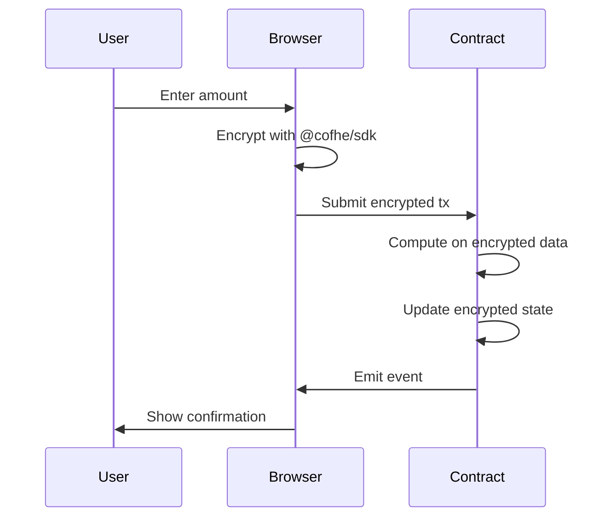
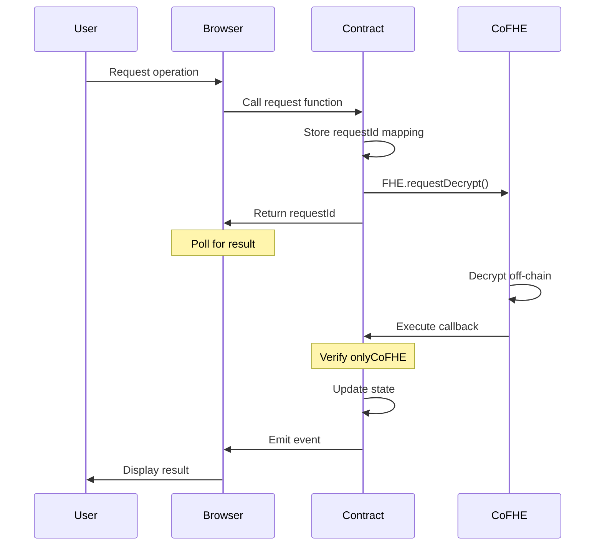
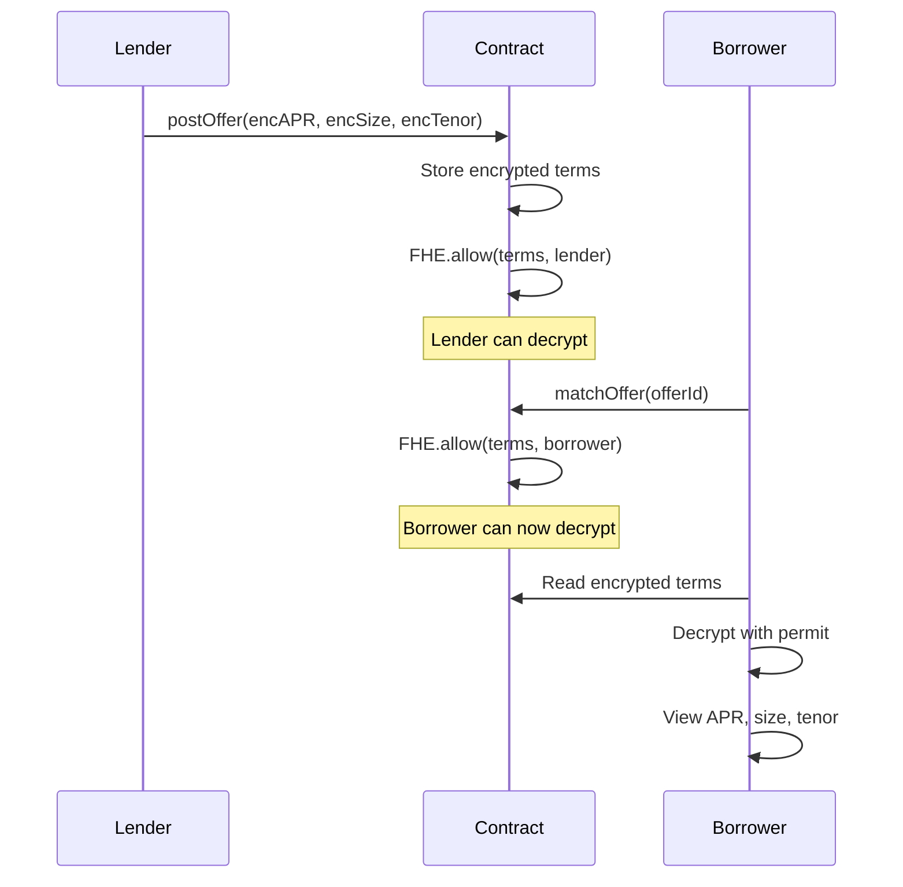
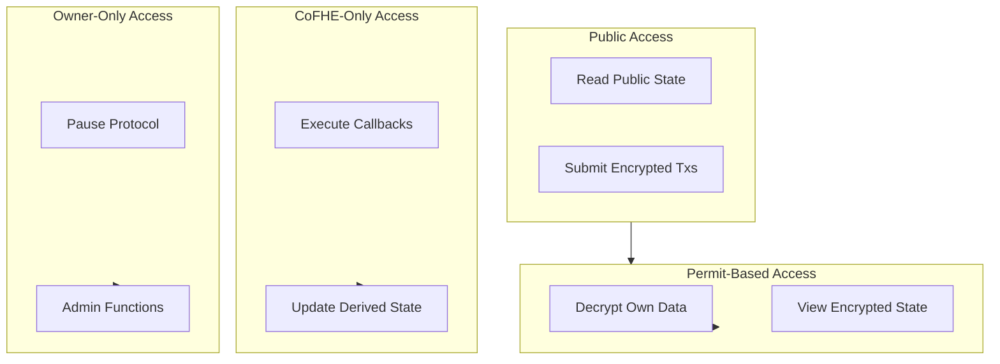
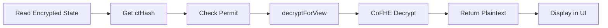

# Walnut Protocol Architecture

## System Overview

Walnut is a privacy-first lending protocol built on Arbitrum Sepolia using Fully Homomorphic Encryption (FHE) via CoFHE SDK v0.5.0. The architecture consists of three main layers: Client, Blockchain, and CoFHE Network.

```mermaid
graph TB
    subgraph Client["Client Layer"]
        UI[Next.js Frontend]
        Hooks[React Hooks]
        SDK[@cofhe/sdk v0.5.0]
        Wallet[Wagmi + RainbowKit]
    end
    
    subgraph Blockchain["Arbitrum Sepolia"]
        Contract[WalnutV1 Contract]
        State[Encrypted State Storage]
        Events[Event Emission]
    end
    
    subgraph CoFHE["CoFHE Network"]
        Encrypt[Input Encryption]
        Decrypt[Async Decryption]
        Callback[Callback Execution]
    end
    
    UI --> Hooks
    Hooks --> SDK
    Hooks --> Wallet
    SDK --> Encrypt
    Wallet --> Contract
    Contract --> State
    Contract --> Events
    Contract --> Decrypt
    Decrypt --> Callback
    Callback --> Contract
    Events --> UI
```

---

## Component Architecture

### 1. Frontend Layer

**Technology Stack:**
- Next.js 16.2.1 (React framework)
- TypeScript (type safety)
- Tailwind CSS (styling)
- @cofhe/react v0.5.0 (FHE React hooks)

**Key Components:**

```
app/
├── page.tsx                    # Landing page
├── app/
│   ├── page.tsx               # Dashboard
│   ├── deposit/page.tsx       # Deposit flow
│   ├── borrow/page.tsx        # Borrow flow
│   ├── repay/page.tsx         # Repay flow
│   ├── withdraw/page.tsx      # Withdraw flow
│   ├── liquidation/page.tsx   # Liquidation UI
│   ├── p2p/page.tsx           # P2P lending
│   ├── history/page.tsx       # Transaction history
│   └── settings/page.tsx      # ENS aggregation
```

**Custom Hooks:**

```typescript
// hooks/use-walnut-protocol.ts
export function useWalnutProtocol() {
  // Wallet connection state
  // Encrypted balance management
  // Transaction submission
  // Decryption with permits
  // Event listening
}
```

---

### 2. Smart Contract Layer

**Contract Structure:**

```
contracts/
├── WalnutV1.sol              # Main protocol contract
├── interfaces/
│   └── IWalnutV1.sol         # Contract interface
└── libraries/
    └── FHELib.sol            # FHE utility functions
```

**State Architecture:**

```solidity
contract WalnutV1 {
    // Encrypted user state
    mapping(address => euint128) public collateral;
    mapping(address => euint128) public debt;
    mapping(address => euint128) public repaymentCount;
    mapping(address => euint128) public defaultCount;
    
    // Encrypted pool state
    euint128 public totalPoolCollateral;
    euint128 public totalPoolDebt;
    
    // Public derived state
    mapping(address => uint8) public creditTier;
    mapping(address => bool) public liquidatable;
    
    // Auction state
    mapping(address => Auction) public auctions;
    mapping(address => mapping(uint256 => euint128)) public bids;
    
    // P2P state
    mapping(uint256 => Offer) public offers;
    uint256 public offerCount;
    
    // ENS aggregation
    mapping(address => address[]) public linkedWallets;
}
```

---

## Data Flow Patterns

### Pattern 1: Synchronous Encrypted Operations

Used for: Deposit, Borrow, Repay, Withdraw



**Example: Deposit Flow**

```typescript
// 1. User input
const amount = "1000";

// 2. Encrypt in browser
const [encrypted] = await encryptor.encryptInputsAsync([
  Encryptable.uint128(BigInt(amount))
]);

// 3. Submit transaction
const hash = await writer.writeContractAsync({
  address: walnutContractAddress,
  abi: walnutV1Abi,
  functionName: "deposit",
  args: [encrypted],
});

// 4. Wait for confirmation
await publicClient.waitForTransactionReceipt({ hash });

// 5. Refresh encrypted balances
await refreshBalances();
```

---

### Pattern 2: Async Decrypt with Callback

Used for: Credit tier updates, Liquidation checks, Auction settlement



**Example: Credit Tier Update**

```typescript
// 1. Request tier update
const tx = await contract.requestCreditTierUpdate(userAddress);
await tx.wait();

// 2. Contract requests decrypt
// FHE.requestDecrypt(repaymentCount[user], this.onCreditCountDecrypted.selector)

// 3. Poll for result
const pollInterval = setInterval(async () => {
  const tier = await contract.creditTier(userAddress);
  if (tier !== previousTier) {
    clearInterval(pollInterval);
    console.log("Tier updated:", tier);
  }
}, 5000);

// 4. CoFHE calls callback
// onCreditCountDecrypted(requestId, decryptedCount)

// 5. Contract updates tier
// creditTier[user] = computeTier(decryptedCount)
```

---

### Pattern 3: Selective Disclosure

Used for: P2P lending, ENS aggregation



**Example: P2P Offer Flow**

```typescript
// 1. Lender posts offer
const [encAPR, encSize, encTenor] = await encryptor.encryptInputsAsync([
  Encryptable.uint128(500n),  // 5% APR
  Encryptable.uint128(10000n), // 10000 units
  Encryptable.uint128(365n),   // 365 days
]);

await contract.postOffer(encAPR, encSize, encTenor);
// Contract calls: FHE.allow(encAPR, msg.sender)

// 2. Borrower matches offer
await contract.matchOffer(offerId);
// Contract calls: FHE.allow(encAPR, borrower)

// 3. Borrower decrypts terms
const aprHandle = await contract.getEncryptedOfferAPR(offerId);
const apr = await cofheClient
  .decryptForView(aprHandle.ctHash, FheTypes.Uint128)
  .withPermit()
  .execute();
// Result: 500n (5% APR)
```

---

## Security Architecture

### Access Control Model



### Modifier Hierarchy

```solidity
// 1. Public functions (no modifier)
function deposit(InEuint128 encryptedAmount) external {
    // Anyone can deposit
}

// 2. Permit-based access (enforced client-side)
function getEncryptedCollateral(address user) external view returns (euint128) {
    // Returns encrypted value
    // User needs permit to decrypt
}

// 3. CoFHE-only callbacks
modifier onlyCoFHE() {
    require(msg.sender == TASK_MANAGER_ADDRESS, "Only CoFHE");
    _;
}

function onCreditCountDecrypted(uint256 requestId, uint128 result) 
    external 
    onlyCoFHE 
{
    // Only CoFHE can call this
}

// 4. Owner-only admin
modifier onlyOwner() {
    require(msg.sender == owner, "Only owner");
    _;
}

function pause() external onlyOwner {
    // Only owner can pause
}
```

---

## Encryption Flow

### Input Encryption (Client → Contract)

```mermaid
flowchart LR
    A[User Input] --> B[Parse to BigInt]
    B --> C[@cofhe/sdk Encrypt]
    C --> D[InEuint128 Struct]
    D --> E[Submit Transaction]
    E --> F[Contract Receives]
    F --> G[FHE.asEuint128]
    G --> H[euint128 Handle]
```

**Code Example:**

```typescript
// Client-side encryption
import { Encryptable } from '@cofhe/sdk';
import { useCofheEncrypt } from '@cofhe/react';

const encryptor = useCofheEncrypt();

// Encrypt amount
const amount = BigInt(1000);
const [encrypted] = await encryptor.encryptInputsAsync([
  Encryptable.uint128(amount)
]);

// encrypted is InEuint128 struct:
// { data: Uint8Array, utype: 7 }

// Submit to contract
await contract.deposit(encrypted);
```

```solidity
// Contract-side decoding
function deposit(InEuint128 calldata encryptedAmount) external {
    // Convert InEuint128 to euint128 handle
    euint128 amount = FHE.asEuint128(encryptedAmount);
    
    // Compute on encrypted value
    collateral[msg.sender] = FHE.add(collateral[msg.sender], amount);
    totalPoolCollateral = FHE.add(totalPoolCollateral, amount);
    
    // Grant read permission
    FHE.allow(collateral[msg.sender], msg.sender);
}
```

---

### Output Decryption (Contract → Client)



**Code Example:**

```typescript
// Read encrypted value
const encryptedCollateral = await contract.getEncryptedCollateral(userAddress);
// Returns: { ctHash: bigint, utype: number }

// Decrypt with permit
const plaintext = await cofheClient
  .decryptForView(encryptedCollateral.ctHash, FheTypes.Uint128)
  .setChainId(421614)
  .setAccount(userAddress)
  .withPermit() // Uses active permit
  .execute();

// Result: bigint (e.g., 1000n)
```

---

## Event Architecture

### Event Types

```solidity
// Synchronous events (emitted immediately)
event DepositSubmitted(address indexed user, uint256 timestamp);
event BorrowSubmitted(address indexed user, uint256 timestamp);
event RepaySubmitted(address indexed user, uint256 timestamp);
event WithdrawSubmitted(address indexed user, uint256 timestamp);

// Async events (emitted after callback)
event CreditTierUpdated(address indexed user, uint8 tier);
event LiquidationTriggered(address indexed user);
event AuctionSettled(address indexed borrower, address indexed winner);

// P2P events
event OfferPosted(uint256 indexed offerId, address indexed lender);
event OfferMatched(uint256 indexed offerId, address indexed borrower);

// Aggregation events
event WalletLinked(address indexed primary, address indexed linked);
event AggregatedCollateralHandle(address indexed owner, euint128 handle);
```

### Event Listening Pattern

```typescript
// Listen for specific events
contract.on("DepositSubmitted", (user, timestamp) => {
  if (user === currentUser) {
    console.log("Deposit confirmed at", timestamp);
    refreshBalances();
  }
});

// Listen for async completion
contract.on("CreditTierUpdated", (user, tier) => {
  if (user === currentUser) {
    console.log("Credit tier updated to", tier);
    updateUI();
  }
});
```

---

## Performance Considerations

### Gas Optimization

**Encrypted Operations:**
- Deposit: ~150k gas
- Borrow: ~200k gas (includes LTV check)
- Repay: ~180k gas (includes credit scoring)
- Withdraw: ~170k gas (includes availability check)

**Async Operations:**
- Request decrypt: ~100k gas
- Callback execution: ~80k gas

**Optimization Techniques:**
1. Batch FHE operations where possible
2. Use FHE.select for conditional updates (avoids branching)
3. Minimize encrypted state reads
4. Cache public derived state (creditTier, liquidatable)

### Latency Profile

**Synchronous Operations:**
- Encryption: <100ms (client-side)
- Transaction submission: ~2s (Arbitrum block time)
- Confirmation: ~2s (1 block)
- Total: ~4s

**Async Operations:**
- Request submission: ~2s
- CoFHE processing: 10-30s
- Callback execution: ~2s
- Total: 15-35s

---

## Deployment Architecture

### Network Configuration

```typescript
// Arbitrum Sepolia
export const walnutChainId = 421614;
export const walnutContractAddress = "0x1afb1765eA821c394d2459C4f40B267E3D86528b";

// RPC endpoints (with fallbacks)
const rpcUrls = [
  "https://sepolia-rollup.arbitrum.io/rpc",
  process.env.NEXT_PUBLIC_RPC_URL_FALLBACK_1,
  process.env.NEXT_PUBLIC_RPC_URL_FALLBACK_2,
];

// CoFHE configuration
export const cofheConfig = createCofheConfig({
  environment: "react",
  supportedChains: [arbSepolia],
  react: {
    autogeneratePermits: true,
    shareablePermits: false,
    position: "bottom-right",
    initialTheme: "dark",
  },
});
```

### Infrastructure Requirements

**Frontend:**
- Node.js 18+
- Next.js 16.2.1
- 2GB RAM minimum
- CDN for static assets

**Smart Contract:**
- Arbitrum Sepolia testnet
- ~2M gas for deployment
- Verified on Arbiscan

**External Dependencies:**
- CoFHE Network (decryption service)
- Arbitrum RPC (transaction submission)
- WalletConnect (wallet connection)

---

## Testing Architecture

### Test Structure

```
test/
├── WalnutV1.test.js          # Main contract tests
├── fixtures/
│   └── deploy.js             # Deployment fixtures
└── helpers/
    └── fhe-helpers.js        # FHE testing utilities
```

### Test Coverage

**Unit Tests:**
- ✓ Deposit/borrow/repay/withdraw flows
- ✓ Credit tier computation (all thresholds)
- ✓ LTV enforcement per tier
- ✓ Liquidation checks
- ✓ Auction mechanics
- ✓ P2P offer matching
- ✓ ENS aggregation
- ✓ Access control (onlyCoFHE, onlyOwner)
- ✓ Pause mechanism

**Integration Tests:**
- ✓ Complete lending cycle
- ✓ Async callback execution
- ✓ Multi-user scenarios
- ✓ Edge cases (zero amounts, overflow)

**Status:** 8/8 tests passing

---

## Monitoring & Observability

### Key Metrics

**On-Chain Metrics:**
- Total value locked (encrypted)
- Active users
- Transaction volume
- Gas usage per operation
- Async operation latency

**Off-Chain Metrics:**
- Frontend load time
- Encryption/decryption time
- RPC response time
- CoFHE availability

### Event Monitoring

```typescript
// Track async operation completion
const asyncOps = new Map<string, { startTime: number, type: string }>();

contract.on("CreditTierUpdated", (user, tier, event) => {
  const op = asyncOps.get(user);
  if (op) {
    const latency = Date.now() - op.startTime;
    console.log(`${op.type} completed in ${latency}ms`);
    asyncOps.delete(user);
  }
});
```

---

## Future Architecture Enhancements

### Planned Improvements

1. **Multi-Asset Collateral**
   - Support multiple token types
   - Encrypted price feeds
   - Cross-asset LTV calculations

2. **Cross-Chain State**
   - Bridge encrypted state between chains
   - Unified liquidity pools
   - Cross-chain liquidations

3. **Advanced Risk Models**
   - Machine learning on encrypted data
   - Dynamic interest rates
   - Portfolio optimization

4. **Governance**
   - Encrypted voting
   - Parameter updates
   - Protocol upgrades

---

## Conclusion

Walnut's architecture demonstrates that privacy-preserving DeFi is practical and performant. By leveraging FHE through CoFHE SDK, the protocol achieves:

- **Privacy**: All sensitive financial data stays encrypted
- **Functionality**: Full lending protocol with advanced features
- **Performance**: Reasonable gas costs and latency
- **Security**: Multi-layer access control and verification

The modular design enables future enhancements while maintaining backward compatibility and security guarantees.
