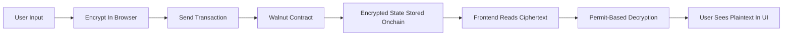
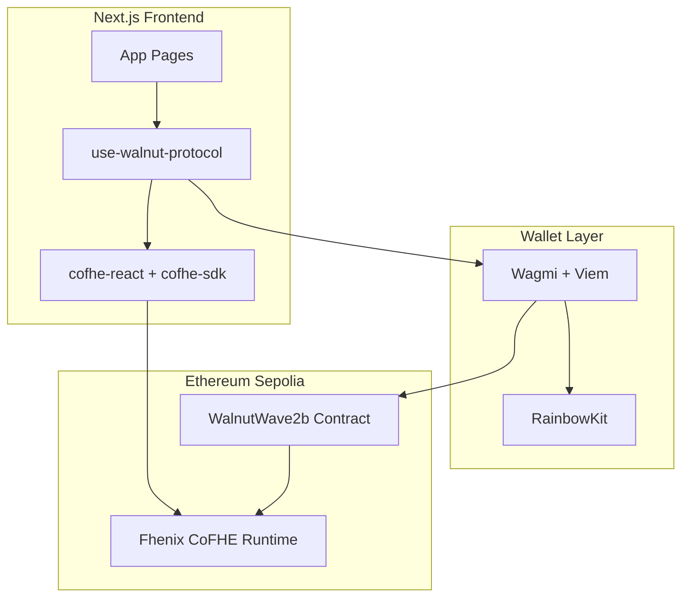
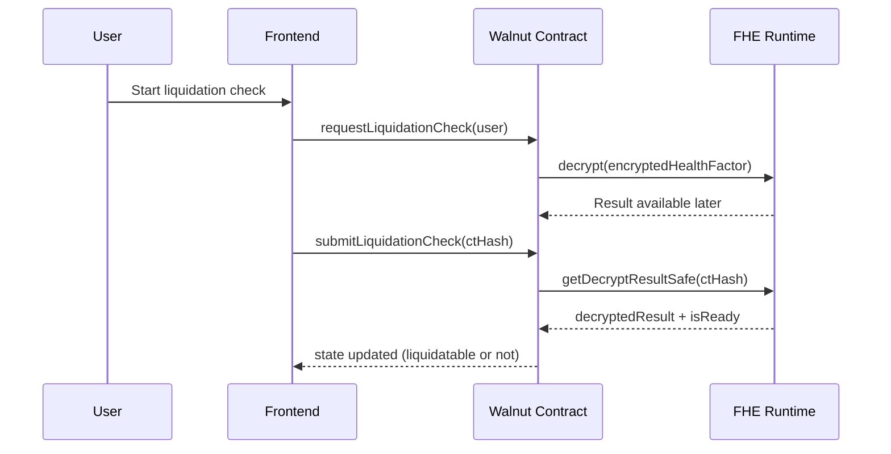

<div align="center">

# Walnut - Private Lending, Finally

### Privacy-first lending on Fhenix using Fully Homomorphic Encryption (FHE)

[](https://nextjs.org)
[](https://react.dev)
[](https://docs.fhenix.zone)
[](#vision)

</div>

## Project Idea (Simple Version)

Walnut is a privacy-first lending protocol on Ethereum Sepolia using Fhenix Fully Homomorphic Encryption (FHE).

Most lending apps expose your collateral, debt, and risk profile publicly on-chain. Walnut changes that by keeping sensitive financial values encrypted from end to end.

In simple terms:

- You can deposit, borrow, repay, and withdraw.
- The protocol computes on encrypted values.
- Only authorized users can decrypt and view sensitive numbers in the UI.

This makes Walnut useful for both technical builders and non-technical users who want private financial operations.

## What Is Live Right Now

The current implementation already includes:

- Encrypted deposit and borrow flows
- Encrypted repay and withdraw flows
- Encrypted health factor retrieval and display
- Liquidation eligibility checks with async decrypt + finalize flow
- Sealed-bid liquidation auctions (bid amounts stay encrypted)
- ENS wallet linking and aggregated encrypted collateral
- Frontend pages for dashboard, deposit, borrow, repay, withdraw, liquidation, and settings

## Live Deployment (Ethereum Sepolia)

- Chain ID: 11155111
- Active contract: 0xD6792922Bca01d34E543cf241D4B3474207d2594
- Etherscan: https://sepolia.etherscan.io/address/0xD6792922Bca01d34E543cf241D4B3474207d2594

## Product Flow At A Glance



## High-Level Architecture



## Core Technical Implementation

### Smart Contract

Primary contract: WalnutWave2b

Main capabilities:

- `deposit(InEuint128)`
- `borrow(InEuint128)`
- `repay(InEuint128)`
- `withdraw(InEuint128)`
- `getHealthFactor(address)`
- `requestLiquidationCheck(address)`
- `submitLiquidationCheck(bytes32)`
- `openAuction(address)`
- `submitBid(address, InEuint128)`
- `selectWinningBid(address)`
- `finalizeWinnerSelection(uint256)`
- `registerENSWallet(string,address)`
- `getAggregatedCollateral(address)`

Contract-level protections implemented:

- 80% LTV cap enforcement on borrow
- Available collateral check on withdraw
- Liquidation threshold checks
- No plaintext bid amount leakage in settlement events
- Duplicate-link and invalid ENS wallet link prevention

### Frontend

The frontend is a Next.js app that:

- Encrypts user inputs before tx submission
- Waits for transaction confirmations
- Reads encrypted state from contract
- Decrypts only with valid permits
- Displays human-readable status for success/failure outcomes

Main app routes:

- `/` landing page
- `/app` dashboard
- `/app/deposit`
- `/app/borrow`
- `/app/repay`
- `/app/withdraw`
- `/app/liquidation`
- `/app/settings`

### Async Decrypt + Finalize Pattern

Some flows require asynchronous decrypt readiness before final state transitions.



The same pattern is used for auction winner selection:

- select winner request
- async decrypt readiness
- explicit finalize transaction

## For Non-Technical Readers: What Privacy Means Here

- Your raw collateral and debt values are not openly written in plain text.
- The protocol performs key calculations on encrypted values.
- Decryption in the app is permit-based and user-controlled.
- On-chain metadata (wallet address, timestamps, gas usage) is still visible, because that is native to public blockchains.

## Local Setup

### 1) Install dependencies

```bash
npm install
```

### 2) Configure environment

Create `.env.local` from `.env.example` and fill required values.

```bash
cp .env.example .env.local
```

Required variables:

- `PRIVATE_KEY` (deployment only, never expose publicly)
- `RPC_URL` (deployment RPC)
- `NEXT_PUBLIC_CHAIN_ID` (11155111 for Sepolia)
- `NEXT_PUBLIC_RPC_URL_PRIMARY`
- `NEXT_PUBLIC_RPC_URL_FALLBACK_1`
- `NEXT_PUBLIC_RPC_URL_FALLBACK_2`
- `NEXT_PUBLIC_WALLETCONNECT_PROJECT_ID`
- `NEXT_PUBLIC_WALNUT_WAVE2_CONTRACT_ADDRESS`

### 3) Run the app

```bash
npm run dev
```

Open: http://localhost:3000

### 4) Build for production

```bash
npm run build
npm run start
```

## Deployment Commands

The repository currently includes these scripts:

- `npm run deploy:sepolia`
- `npm run deploy:wave2:sepolia`

Verify deployed contract:

```bash
npx hardhat verify --network sepolia <DEPLOYED_CONTRACT_ADDRESS>
```

## Testing

Smart contract tests are included and pass in local Hardhat mock environment.

Run:

```bash
npx hardhat test
```

## Known Constraints

- Blockchain metadata is still public (addresses, tx timing, gas usage).
- Privacy applies to encrypted financial values and encrypted computations.

## Why This Matters

Walnut demonstrates that lending UX can stay familiar while sensitive financial state stays encrypted by default.

It is a practical path toward privacy-preserving DeFi without sacrificing on-chain verifiability.
