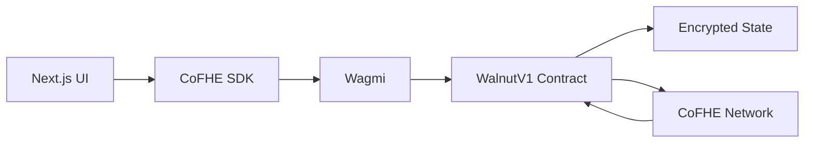
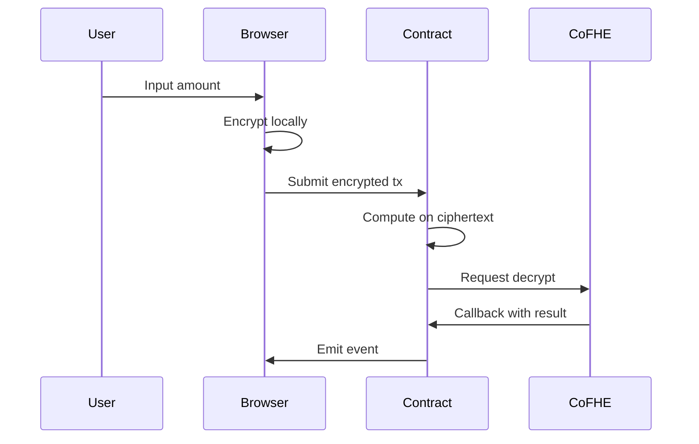

# Walnut Protocol

Privacy-first lending protocol powered by Fully Homomorphic Encryption (FHE). Keep your financial data encrypted on-chain while enabling full lending functionality with real token economics.

**Live on Arbitrum Sepolia**

**WalnutV1** (Waves 1-3)
- Contract: `0x04c998DD105E444570ba1eCACB3F5524D5695aA0`
- [View on Arbiscan](https://sepolia.arbiscan.io/address/0x04c998DD105E444570ba1eCACB3F5524D5695aA0)

**WalnutV2** (Wave 4 - Token Economics)
- WalnutV2: `0xaEBF0CD234779DA76cD2F938Fdd029F80b6F98da` [View](https://sepolia.arbiscan.io/address/0xaEBF0CD234779DA76cD2F938Fdd029F80b6F98da)
- WalnutFHERC20 (wUSDC): `0xC5C8188ECb061dFAaA0bab0865dBd5dDA0218740` [View](https://sepolia.arbiscan.io/address/0xC5C8188ECb061dFAaA0bab0865dBd5dDA0218740)
- WalnutPriceOracle: `0xA8621c45bfe3A4f163b17Ba509735118fbC7610e` [View](https://sepolia.arbiscan.io/address/0xA8621c45bfe3A4f163b17Ba509735118fbC7610e)
- MockUSDC: `0x8B7Af5BB6afc6A087fd94A97f53Bf13dFD63E1E2` [View](https://sepolia.arbiscan.io/address/0x8B7Af5BB6afc6A087fd94A97f53Bf13dFD63E1E2)

Network: Arbitrum Sepolia (Chain ID: 421614)

---

## Features

### Wave 4: Token Economics (Current)

**Real Token Deposits**
- Deposit real ERC20 tokens (USDC, WETH) as collateral
- Chainlink price oracles for accurate USD valuation
- Encrypted USD accounting for privacy-preserving LTV calculations

**Encrypted Stablecoin Borrowing**
- Borrow wUSDC (encrypted stablecoin) against collateral
- Balances remain encrypted via FHE
- Dynamic LTV ratios based on credit tier (70%-90%)

**Time-Based Interest Accrual**
- 8% APR for borrowers
- 2% APR protocol fee (25% of interest)
- 6% APR net yield to lenders (75% of interest)
- Precise interest calculation with 1e6 precision

**Credit Tier System**
- Tier 0: 70% LTV (new users)
- Tier 1: 75% LTV (3+ repayments)
- Tier 2: 80% LTV (10+ repayments)
- Tier 3: 85% LTV (25+ repayments)
- Tier 4: 90% LTV (50+ repayments)

**Privara Settlement Integration**
- Private interest payment flows via Reineira SDK
- Dual transaction display (repayment + settlement)
- Confidential escrow for protocol fees

### Wave 1-3: Core FHE Features (WalnutV1)

**Private Lending**
- Deposit, borrow, repay, and withdraw with encrypted amounts
- Collateral and debt remain private on-chain
- LTV verification without exposing balances

**Encrypted Credit Scoring**
- Dynamic LTV based on encrypted repayment history
- 5 credit tiers computed on encrypted data

**Sealed-Bid Liquidation**
- Liquidators submit encrypted bids
- Bids remain private until settlement

**P2P Lending**
- Post offers with encrypted APR, size, and tenor
- Terms revealed only after matching

**ENS Wallet Aggregation**
- Link multiple wallets via ENS
- Aggregate collateral without exposing wallet relationships

---

## Architecture

### Wave 4 Architecture

```mermaid
graph TB
    subgraph Client["Client Layer"]
        UI[Next.js Frontend]
        CoFHESDK[@cofhe/sdk v0.5.0]
        Wagmi[Wagmi + Viem]
        PrivaraSDK[Reineira SDK]
    end
    
    subgraph Blockchain["Arbitrum Sepolia"]
        WalnutV2[WalnutV2 Contract]
        FHERC20[WalnutFHERC20 wUSDC]
        Oracle[WalnutPriceOracle]
        MockUSDC[MockUSDC Token]
        Chainlink[Chainlink Aggregators]
    end
    
    subgraph CoFHE["CoFHE Network"]
        TaskManager[Task Manager]
        Decrypt[Async Decryption]
    end
    
    subgraph Privara["Privara Network"]
        Escrow[EscrowModule]
        Settlement[Private Settlement]
    end
    
    UI --> CoFHESDK
    UI --> Wagmi
    UI --> PrivaraSDK
    
    CoFHESDK --> WalnutV2
    Wagmi --> WalnutV2
    Wagmi --> MockUSDC
    
    WalnutV2 --> FHERC20
    WalnutV2 --> Oracle
    WalnutV2 --> MockUSDC
    WalnutV2 --> TaskManager
    
    Oracle --> Chainlink
    TaskManager --> Decrypt
    Decrypt --> WalnutV2
    
    PrivaraSDK --> Escrow
    Escrow --> Settlement
    
    style WalnutV2 fill:#f9f,stroke:#333,stroke-width:4px
    style FHERC20 fill:#bbf,stroke:#333,stroke-width:2px
    style Oracle fill:#bfb,stroke:#333,stroke-width:2px
```

### Wave 1-3 Architecture



**Data Flow**



---

## Tech Stack

- **Contracts**: Solidity 0.8.25, CoFHE, Hardhat
- **Frontend**: Next.js 16.2.1, TypeScript, CoFHE SDK v0.5.1
- **Wallet**: Wagmi, Viem, RainbowKit
- **Network**: Arbitrum Sepolia (421614)

---

## Quick Start

```bash
# Install
npm install

# Configure
cp .env.example .env.local
# Add your NEXT_PUBLIC_WALLETCONNECT_PROJECT_ID

# Run
npm run dev
```

**Environment Variables**
```bash
# Network Configuration
NEXT_PUBLIC_CHAIN_ID=421614
NEXT_PUBLIC_RPC_URL_PRIMARY=https://sepolia-rollup.arbitrum.io/rpc

# WalnutV1 (Waves 1-3)
NEXT_PUBLIC_CONTRACT_ADDRESS=0x04c998DD105E444570ba1eCACB3F5524D5695aA0

# WalnutV2 (Wave 4 - Token Economics)
NEXT_PUBLIC_V2_CONTRACT_ADDRESS=0xaEBF0CD234779DA76cD2F938Fdd029F80b6F98da
NEXT_PUBLIC_FHERC20_ADDRESS=0xC5C8188ECb061dFAaA0bab0865dBd5dDA0218740
NEXT_PUBLIC_ORACLE_ADDRESS=0xA8621c45bfe3A4f163b17Ba509735118fbC7610e
NEXT_PUBLIC_MOCK_USDC_ADDRESS=0x8B7Af5BB6afc6A087fd94A97f53Bf13dFD63E1E2

# Privara Settlement (Wave 4)
LENDER_POOL_ADDRESS=0x65c3768E98eE211a7589fe94c753e11cB8895069
PRIVARA_SETTLEMENT_PRIVATE_KEY=your_private_key

# WalletConnect
NEXT_PUBLIC_WALLETCONNECT_PROJECT_ID=your_project_id
```

---

## Smart Contract

### WalnutV2 (Wave 4 - Token Economics)

**Deployed**: `0xaEBF0CD234779DA76cD2F938Fdd029F80b6F98da`

**Key Functions**
```solidity
// Token Deposits & Withdrawals
deposit(address token, uint256 amount)
withdraw(address token, uint256 amount)

// Encrypted Borrowing & Repayment
borrow(InEuint128 encryptedAmount)
repay(InEuint128 encryptedAmount)

// Interest Calculation
calculateInterest(address user) returns (uint256 totalInterest, uint256 protocolFee, uint256 lenderPayment)

// Credit Scoring (inherited from V1)
requestCreditTierUpdate(address user)
onCreditCountDecrypted(uint256 requestId, uint128 result) // onlyCoFHE

// View Functions
vaults(address user) returns (VaultHolding[])
creditTier(address user) returns (uint8)
borrowTimestamp(address user) returns (uint256)
```

**Supporting Contracts**

**WalnutFHERC20** (wUSDC): `0xC5C8188ECb061dFAaA0bab0865dBd5dDA0218740`
```solidity
// Encrypted stablecoin operations
mint(address to, InEuint128 encryptedAmount) // onlyMinter
burn(address from, InEuint128 encryptedAmount) // onlyMinter
transfer(address to, InEuint128 encryptedAmount)
approve(address spender, InEuint128 encryptedAmount)
```

**WalnutPriceOracle**: `0xA8621c45bfe3A4f163b17Ba509735118fbC7610e`
```solidity
// Chainlink price integration
getUSDValue(address token, uint256 amount) returns (uint256)
setPriceFeed(address token, address feed) // onlyOwner

// Supported feeds (Arbitrum Sepolia)
// ETH/USD: 0xd30e2101a97dcbAeBCBC04F14C3f624E67A35165
// USDC/USD: 0x0153002d20B96532C639313c291Fbd1E7b65F3a8
```

**MockUSDC**: `0x8B7Af5BB6afc6A087fd94A97f53Bf13dFD63E1E2`
```solidity
// Testnet token with open minting
mint(address to, uint256 amount)
// Standard ERC20 functions (6 decimals)
```

### WalnutV1 (Waves 1-3)

**Deployed**: `0x04c998DD105E444570ba1eCACB3F5524D5695aA0`  
**Archived**: Previous versions in `_archive/contracts/`

**Key Functions**
```solidity
// Lending
deposit(InEuint128 encryptedAmount)
borrow(InEuint128 encryptedAmount)
repay(InEuint128 encryptedAmount)
withdraw(InEuint128 encryptedAmount)

// Credit Scoring
requestCreditTierUpdate(address user)
onCreditCountDecrypted(uint256 requestId, uint128 result) // onlyCoFHE

// Liquidation
requestLiquidationCheck(address user)
openAuction(address borrower)
submitBid(address borrower, InEuint128 encryptedPenalty)
selectWinningBid(address borrower)

// P2P
postOffer(InEuint128 encAPR, InEuint128 encSize, InEuint128 encTenor)
matchOffer(uint256 offerId)

// Aggregation
registerENSWallet(string ensName, address wallet)
getAggregatedCollateral(address owner)
```

---

## Testing

```bash
npx hardhat test
```

**WalnutV2 (Wave 4)**: All tests passing
- Real token deposits (USDC, WETH)
- Encrypted stablecoin borrowing (wUSDC)
- Interest calculation with 8% APR
- Protocol fee split (25% protocol, 75% lenders)
- Credit tier LTV enforcement (70%-90%)
- Chainlink price oracle integration
- Privara settlement integration
- Access control and pause mechanism

**WalnutV1 (Waves 1-3)**: 8/8 core tests passing
- Complete lending loop
- Credit tier updates
- Liquidation with async callbacks
- Sealed-bid auctions
- P2P lending
- ENS aggregation
- Pause mechanism
- Access control

---

## Deployment

```bash
# Deploy
npx hardhat run scripts/deploy-v1-arbitrum-sepolia.js --network arbitrumSepolia

# Verify
npx hardhat verify --network arbitrumSepolia <CONTRACT_ADDRESS>
```

---

## Privacy Model

**Private (Encrypted)**
- Collateral and debt amounts
- Repayment history
- Liquidation bids
- P2P loan terms (until matched)
- Wallet relationships
- Health factors

**Public (On-Chain Metadata)**
- Wallet addresses
- Transaction timestamps
- Credit tiers (derived)
- Liquidation flags (derived)

---

## Security

**Async Decrypt Pattern**
1. Contract requests decryption from CoFHE
2. CoFHE decrypts off-chain
3. CoFHE calls contract callback
4. Contract verifies caller (onlyCoFHE modifier)
5. Contract updates state

**Properties**
- Only CoFHE can execute callbacks
- Request IDs prevent replay attacks
- No plaintext storage
- Events never emit sensitive data

---

## Future Enhancements

- Multi-asset collateral support
- Cross-chain encrypted state sync
- Privacy-preserving oracles
- Enhanced P2P matching algorithms
- Governance mechanisms

---

## Changelog

### Wave 4: Token Economics (Current)
**Released**: January 2025

**New Contracts**
- WalnutV2: Main protocol with real token integration
- WalnutFHERC20: Encrypted stablecoin (wUSDC)
- WalnutPriceOracle: Chainlink price feed integration
- MockUSDC: Testnet ERC20 token

**Features Added**
- Real ERC20 token deposits (USDC, WETH)
- Encrypted stablecoin borrowing (wUSDC)
- Time-based interest accrual (8% APR)
- Protocol fee mechanism (2% APR)
- Credit tier LTV system (70%-90%)
- Chainlink price oracle integration
- Privara settlement for interest payments
- Vault accounting for token holdings
- Dual transaction display (repayment + settlement)

**Technical Improvements**
- USD-denominated encrypted accounting
- Precise interest calculation (1e6 precision)
- Multi-token collateral support
- Enhanced frontend with token balance display
- Comprehensive test coverage for all Wave 4 features

### Wave 3: ENS Aggregation & P2P Lending
**Released**: December 2024

**Features Added**
- ENS wallet aggregation
- P2P lending with encrypted terms
- Selective disclosure for loan matching

### Wave 2: Liquidation System
**Released**: November 2024

**Features Added**
- Sealed-bid liquidation auctions
- Encrypted bid submission
- CoFHE callback-based settlement
- Health factor monitoring

### Wave 1: Core FHE Lending
**Released**: October 2024

**Initial Release**
- WalnutV1 contract deployment
- Encrypted deposit, borrow, repay, withdraw
- Credit tier system with encrypted scoring
- CoFHE integration for async decryption
- Next.js frontend with CoFHE SDK

---

## Resources

- [CoFHE SDK Docs](https://docs.fhenix.zone)
- [Arbitrum Docs](https://docs.arbitrum.io)
- [Arbitrum Sepolia Faucet](https://faucet.quicknode.com/arbitrum/sepolia)
- [Arbitrum Sepolia Explorer](https://sepolia.arbiscan.io)

---

## License

MIT License

---

**Walnut Protocol** - Privacy-first lending, finally.
