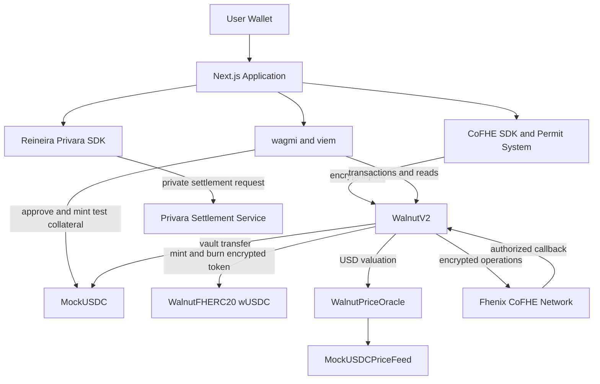
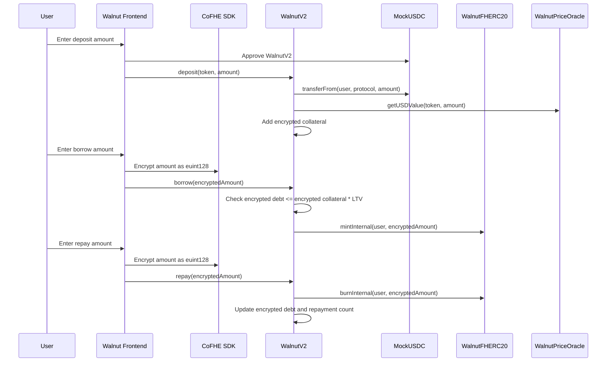
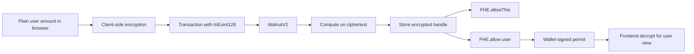

# Walnut Protocol

Walnut is a confidential lending and borrowing protocol built on Fhenix CoFHE. Users deposit real ERC20 collateral and borrow an encrypted stablecoin, wUSDC, while protocol-critical position data remains encrypted on-chain.

The core idea is simple: the protocol can enforce collateral, debt, repayment, and credit rules without publishing a user's financial position.

Tagline: Deposit USDC. Borrow wUSDC. Nobody sees how much.

## Current Deployment

Network: Arbitrum Sepolia  
Chain ID: `421614`

| Contract | Purpose | Address |
| --- | --- | --- |
| WalnutV2 | Active lending protocol | `0xD647A9533C9C8831E7E95a4dcB2Dda1afDfF934d` |
| WalnutFHERC20 | Encrypted wUSDC token | `0x561152D0a49A6CeFE6046d6762efF57cD7aA57DF` |
| WalnutPriceOracle | Token to USD oracle adapter | `0x5d598F3C9b45191d9f131cCbF957E969Eb173b98` |
| MockUSDC | Testnet collateral token, 6 decimals | `0xaf80C080857956021C0200dFdFC48349eB02F3ff` |
| MockUSDCPriceFeed | Testnet USDC/USD price feed | `0xb93D1D4A01E5ed25a96519154F976117d333740b` |
| WalnutV1 | Earlier initial release to advanced features contract | `0x04c998DD105E444570ba1eCACB3F5524D5695aA0` |

The active application is configured to use WalnutV2. WalnutV1 remains deployed as a reference implementation for earlier encrypted lending, liquidation, P2P, and aggregation experiments.

## What Is Implemented

WalnutV2 implements the current release flow:

| Area | Implementation |
| --- | --- |
| Collateral | Users deposit real MockUSDC into WalnutV2. Deposits are tracked as plaintext vault holdings and encrypted USD collateral. |
| Borrowing | Users encrypt borrow amounts client-side and borrow wUSDC through WalnutFHERC20. Debt is stored as `euint128`. |
| Repayment | Users repay encrypted wUSDC. The contract burns wUSDC through the protocol minter path and updates encrypted repayment counters. |
| Withdrawals | Debt-free users can withdraw deposited collateral directly. Withdrawals update encrypted collateral and plaintext vault accounting. |
| Credit tiers | Repayment count is encrypted. Public tier is derived through CoFHE callback flow. |
| Oracle pricing | WalnutPriceOracle converts token amounts to USD value. MockUSDC uses a fixed testnet feed at 1.00 USD. |
| Private settlement | Repay flow integrates Reineira/Privara settlement for private interest settlement metadata. |
| Frontend | Next.js dashboard, wallet connection, permit-based decryption, deposit, borrow, repay, withdraw, and portfolio views. |

Sensitive values are stored as encrypted `euint128` values:

```solidity
mapping(address => euint128) private _collateral;
mapping(address => euint128) private _debt;
mapping(address => euint128) private _repaymentCount;
mapping(address => euint128) private _defaultCount;
```

## System Architecture



## Protocol Flow



## Encrypted State and Permissions

Walnut relies on FHE permissions to keep state usable without making it public.



After writes, WalnutV2 grants:

| Permission | Purpose |
| --- | --- |
| `FHE.allowThis(value)` | Allows WalnutV2 to continue computing over its encrypted state. |
| `FHE.allow(value, user)` | Allows the owner of a position to decrypt their own values in the frontend. |
| CoFHE callback authorization | Restricts decrypted callback updates to the Fhenix task manager address. |

## Credit Tier Model

Repayment history is stored encrypted. The user-facing tier is public because the lending rule needs a simple, observable LTV class.

| Tier | Repayment threshold | Max LTV |
| --- | ---: | ---: |
| 0 | 0 repayments | 70 percent |
| 1 | 3 repayments | 75 percent |
| 2 | 10 repayments | 80 percent |
| 3 | 25 repayments | 85 percent |
| 4 | 50 repayments | 90 percent |

The frontend also includes a local fallback tier derivation from decrypted repayment count when direct callback polling is unavailable.

## Contract Responsibilities

### WalnutV2

Main protocol contract for the active lending flow.

```solidity
deposit(address token, uint256 amount)
borrow(InEuint128 encryptedAmount)
repay(InEuint128 encryptedAmount)
withdraw(address token, uint256 amount)
calculateInterest(address user, uint256 principal)
requestCreditTierUpdate(address user)
grantReadPermissions()
getEncryptedCollateral(address user)
getEncryptedDebt(address user)
```

Important behavior:

| Function | Behavior |
| --- | --- |
| `deposit` | Transfers ERC20 collateral, values it in USD, and increases encrypted collateral. |
| `borrow` | Computes the LTV rule over encrypted values and mints encrypted wUSDC only when valid. |
| `repay` | Burns encrypted wUSDC and updates encrypted debt and repayment count. |
| `withdraw` | Allows debt-free collateral withdrawal and updates vault plus encrypted collateral state. |
| `calculateInterest` | Calculates 8 percent APR interest and a 25 percent protocol fee share of interest. |

### WalnutFHERC20

Encrypted stablecoin used as the borrow asset. WalnutV2 is the only minter and burner.

```solidity
mintInternal(address to, euint128 amount)
burnInternal(address from, euint128 amount)
transfer(address to, InEuint128 encryptedAmount)
approve(address spender, InEuint128 encryptedAmount)
balanceOf(address account)
```

### WalnutPriceOracle

Oracle adapter that maps collateral tokens to Chainlink-compatible feeds and returns USD values with 6 decimals.

### MockUSDC

Mintable ERC20 testnet collateral with 6 decimals. It is intentionally open-mint for demo and reviewer workflows.

## Frontend

The frontend is a Next.js application using wagmi, viem, TanStack Query, and CoFHE React hooks.

Implemented pages:

| Page | Purpose |
| --- | --- |
| Dashboard | Decrypted collateral, debt, available amount, utilization, wallet balances, and vault holdings. |
| Deposit | MockUSDC minting, ERC20 approval, and collateral deposit. |
| Borrow | Client-side encrypted borrow amount request. |
| Repay | Client-side encrypted repayment plus private settlement handling. |
| Withdraw | Collateral withdrawal for debt-free positions. |
| History and Settings | Supporting views for protocol state and user configuration. |
| P2P and Liquidation | Preserved as non-active views while the current deployment focuses on tokenized collateral and wUSDC. |

## Privacy Model

| Data | Visibility |
| --- | --- |
| Collateral value | Encrypted on-chain, decryptable by the user through permit flow. |
| Debt value | Encrypted on-chain, decryptable by the user through permit flow. |
| Repayment count | Encrypted on-chain, used to derive public tier. |
| Borrow and repay amounts | Submitted encrypted for wUSDC flows. |
| Vault token address and token amount | Public plaintext accounting for real ERC20 custody. |
| Credit tier | Public derived value. |
| Transaction sender and timestamps | Public blockchain metadata. |

Walnut does not claim to hide the existence of an interaction. It hides the sensitive lending values that normally reveal a user's financial position.

## Repository Structure

```text
app/                         Next.js application routes
components/                  UI and wallet/provider components
contracts/                   Solidity contracts
contracts/wave4/             WalnutV2, WalnutFHERC20, oracle, and test tokens
hooks/                       Frontend protocol, balance, permit, and settlement hooks
lib/                         Contract addresses, ABIs, and shared utilities
scripts/                     Deployment, verification, minting, and diagnostics
test/                        Hardhat contract tests and helpers
```

## Setup

Install dependencies:

```bash
npm install
```

Create local environment configuration:

```bash
cp .env.example .env.local
```

At minimum, set:

```bash
NEXT_PUBLIC_CHAIN_ID=421614
NEXT_PUBLIC_RPC_URL_PRIMARY=https://sepolia-rollup.arbitrum.io/rpc
NEXT_PUBLIC_WALLETCONNECT_PROJECT_ID=your_walletconnect_project_id
```

For deployment and Privara settlement scripts, also configure:

```bash
PRIVATE_KEY=your_deployer_private_key
PRIVARA_SETTLEMENT_PRIVATE_KEY=your_settlement_private_key
LENDER_POOL_ADDRESS=your_lender_or_treasury_address
```

Run the frontend:

```bash
npm run dev
```

Build the frontend:

```bash
npm run build
```

## Testing and Verification

Compile contracts:

```bash
npx hardhat compile
```

Run the WalnutV2 contract suite:

```bash
npx hardhat test test/unit/contracts/wave4/WalnutV2.test.js
```

Verify the active Arbitrum Sepolia deployment:

```bash
npx hardhat run scripts/verify-wave4-deployment.js --network arbitrumSepolia
```

Recent local verification:

| Check | Result |
| --- | --- |
| `npx hardhat compile` | Passing |
| `npx hardhat test test/unit/contracts/wave4/WalnutV2.test.js` | 61 passing |
| `npx tsc --noEmit` | Passing |
| `npm run build` | Passing |
| Deployment verification script | Passing on Arbitrum Sepolia |

## Deployment

Deploy the full real token integration stack:

```bash
npx hardhat run scripts/deploy-wave4-arbitrum-sepolia.js --network arbitrumSepolia
```

Redeploy only WalnutV2 while reusing the current wUSDC, oracle, and MockUSDC:

```bash
npx hardhat run scripts/redeploy-walnut-v2-only.js --network arbitrumSepolia
```

Mint MockUSDC for testing:

```bash
npx hardhat run scripts/mint-mock-usdc.js --network arbitrumSepolia
```

## Current Scope and Notes

WalnutV2 is the active release contract. It focuses on real collateral deposits, encrypted wUSDC borrowing, encrypted repayment state, permit-based user decryption, oracle valuation, and private settlement integration.

The earlier WalnutV1 contract contains the experimental initial release to advanced features set: encrypted lending primitives, sealed-bid liquidation, P2P lending, and ENS aggregation. Those concepts are preserved in the repository, but the active UI and deployment prioritize the production-style tokenized collateral flow.

Debt-free withdrawals are supported directly in WalnutV2. Withdrawals after borrowing are intentionally blocked in the current contract path because the unsafe async withdrawal decrypt task was removed after live Arbitrum Sepolia testing showed it could revert before wallet fee estimation. This preserves collateral safety for the active deployment.

## License

MIT
