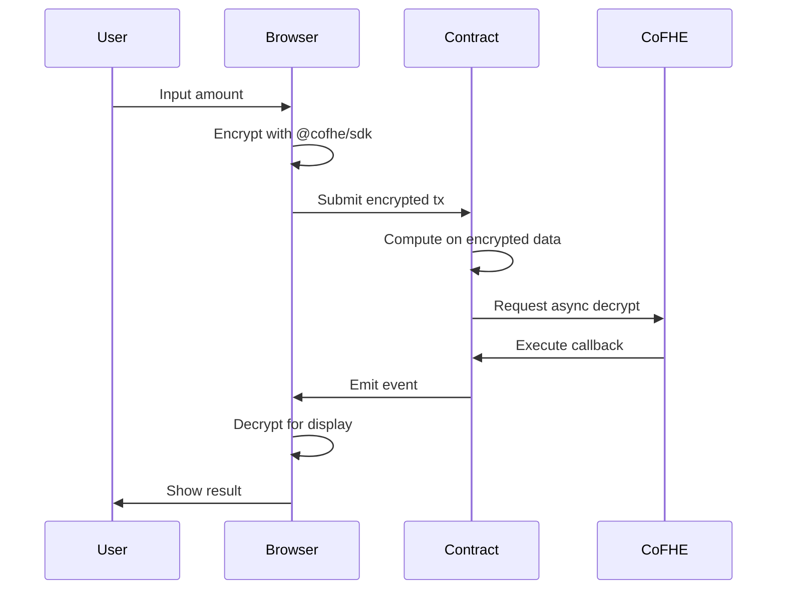

# Walnut Protocol

**Privacy-first lending protocol powered by Fully Homomorphic Encryption**

[](https://nextjs.org)
[](https://docs.fhenix.zone)
[](https://arbitrum.io)
[](LICENSE)

---

## Overview

Walnut is a production-ready lending protocol that keeps your financial data encrypted on-chain. Built on Arbitrum Sepolia using CoFHE SDK v0.5.0, it enables private lending operations without exposing collateral, debt, or risk profiles.

**Live Deployment:**
- **Contract**: `0x1afb1765eA821c394d2459C4f40B267E3D86528b`
- **Network**: Arbitrum Sepolia (Chain ID: 421614)
- **Explorer**: [View on Arbiscan](https://sepolia.arbiscan.io/address/0x1afb1765eA821c394d2459C4f40B267E3D86528b)

---

## Core Features

### 1. Private Lending Operations
- **Deposit**: Add encrypted collateral to your position
- **Borrow**: Take loans with encrypted amounts and LTV verification
- **Repay**: Reduce debt while building encrypted credit history
- **Withdraw**: Remove available collateral privately

### 2. Encrypted Credit Scoring
Dynamic LTV adjustments based on encrypted repayment history:
- Tier 0 (0-1 repayments): 70% LTV
- Tier 1 (2-3 repayments): 75% LTV
- Tier 2 (4-6 repayments): 80% LTV
- Tier 3 (7-9 repayments): 85% LTV
- Tier 4 (10+ repayments): 90% LTV

**Why FHE?** Traditional chains expose repayment history, enabling credit profiling and discrimination.

### 3. Sealed-Bid Liquidation Auctions
Liquidators submit encrypted bids that remain private until settlement. The protocol computes the winning bid using FHE operations without revealing amounts.

**Why FHE?** Transparent bids enable front-running and collusion. Encrypted bids ensure fair price discovery.

### 4. Peer-to-Peer Lending
Lenders post offers with encrypted terms (APR, size, tenor). Terms are only revealed to borrowers after matching.

**Why FHE?** Public loan terms enable predatory targeting. Selective disclosure protects both parties.

### 5. ENS Wallet Aggregation
Aggregate encrypted collateral across multiple linked wallets without exposing wallet relationships.

**Why FHE?** Transparent wallet links enable tracking and surveillance. Encrypted aggregation preserves privacy.

---

## Architecture

```mermaid
flowchart TB
    subgraph Client["Client Layer"]
        UI[Next.js UI]
        SDK[@cofhe/sdk v0.5.0]
        Wallet[Wagmi + RainbowKit]
    end
    
    subgraph Chain["Arbitrum Sepolia"]
        Contract[WalnutV1 Contract]
        State[Encrypted State]
    end
    
    subgraph CoFHE["CoFHE Network"]
        Decrypt[Async Decryption]
        Callback[Callback Execution]
    end
    
    UI --> SDK
    SDK --> Wallet
    Wallet --> Contract
    Contract --> State
    Contract --> Decrypt
    Decrypt --> Callback
    Callback --> Contract
```

### Data Flow



---

## Smart Contract

**Current Version:** WalnutV1 (deployed at `0x1afb1765eA821c394d2459C4f40B267E3D86528b`)

**Previous Versions:** Historical contract versions are preserved in `_archive/contracts/` for reference.

### Core Functions

**Lending Operations:**
```solidity
function deposit(InEuint128 encryptedAmount) external
function borrow(InEuint128 encryptedAmount) external
function repay(InEuint128 encryptedAmount) external
function withdraw(InEuint128 encryptedAmount) external
```

**Credit Scoring:**
```solidity
function requestCreditTierUpdate(address user) external
function onCreditCountDecrypted(uint256 requestId, uint128 result) external onlyCoFHE
```

**Liquidation:**
```solidity
function requestLiquidationCheck(address user) external
function onLiquidationResult(uint256 requestId, uint128 result) external onlyCoFHE
function openAuction(address borrower) external
function submitBid(address borrower, InEuint128 encryptedPenalty) external
function selectWinningBid(address borrower) external
function onWinnerSelected(uint256 requestId, uint128 result) external onlyCoFHE
```

**P2P Lending:**
```solidity
function postOffer(InEuint128 encAPR, InEuint128 encSize, InEuint128 encTenor) external
function matchOffer(uint256 offerId) external
```

**Wallet Aggregation:**
```solidity
function registerENSWallet(string ensName, address wallet) external
function getAggregatedCollateral(address owner) external returns (euint128)
```

### Security Model

**Access Control:**
- `onlyOwner`: Admin functions (pause, unpause)
- `onlyCoFHE`: Callback functions (verified by TASK_MANAGER_ADDRESS)
- `whenNotPaused`: Deposit/borrow restrictions (repay/withdraw always work)

**Encrypted State:**
- User collateral and debt (euint128)
- Pool-level totals (euint128)
- Repayment and default counts (euint128)
- Auction bids (euint128)
- P2P loan terms (euint128)

**Public State:**
- Credit tiers (derived from encrypted counts)
- Liquidation flags (derived from encrypted health factors)
- Auction metadata (addresses, timestamps)

---

## Technology Stack

**Smart Contracts:**
- Solidity ^0.8.25
- @fhenixprotocol/cofhe-contracts
- Hardhat

**Frontend:**
- Next.js 16.2.1
- React 18.3.1
- TypeScript
- @cofhe/sdk v0.5.0
- @cofhe/react v0.5.0
- Wagmi + Viem
- RainbowKit

**Network:**
- Arbitrum Sepolia (421614)
- CoFHE Coprocessor

---

## Quick Start

### Prerequisites
- Node.js 18+
- npm or yarn
- MetaMask or compatible wallet

### Installation

```bash
# Clone repository
git clone <repository-url>
cd walnut

# Install dependencies
npm install

# Configure environment
cp .env.example .env.local
# Edit .env.local with your values
```

### Required Environment Variables

```bash
# Network Configuration
NEXT_PUBLIC_CHAIN_ID=421614
NEXT_PUBLIC_RPC_URL_PRIMARY=https://sepolia-rollup.arbitrum.io/rpc
NEXT_PUBLIC_CONTRACT_ADDRESS=0x1afb1765eA821c394d2459C4f40B267E3D86528b

# Wallet Connection
NEXT_PUBLIC_WALLETCONNECT_PROJECT_ID=your_project_id

# Deployment (optional)
PRIVATE_KEY=your_private_key
ARBITRUM_SEPOLIA_RPC_URL=https://sepolia-rollup.arbitrum.io/rpc
ARBISCAN_API_KEY=your_arbiscan_key
```

### Development

```bash
# Start development server
npm run dev

# Open browser
# http://localhost:3000
```

### Production Build

```bash
# Build for production
npm run build

# Start production server
npm run start
```

---

## Testing

### Smart Contract Tests

```bash
# Run all tests
npx hardhat test

# Run with gas reporting
REPORT_GAS=true npx hardhat test
```

**Test Coverage:**
- ✓ Complete lending loop (deposit → borrow → repay → withdraw)
- ✓ Credit tier updates with all thresholds
- ✓ Liquidation checks with async callbacks
- ✓ Sealed-bid auctions with encrypted bids
- ✓ P2P lending with selective disclosure
- ✓ ENS wallet aggregation
- ✓ Pause mechanism
- ✓ Access control (onlyCoFHE, onlyOwner)

**Status:** 8/8 tests passing

---

## Deployment

### Deploy Contract

```bash
# Deploy to Arbitrum Sepolia
npx hardhat run scripts/deploy-v1-arbitrum-sepolia.js --network arbitrumSepolia

# Verify on Arbiscan
npx hardhat verify --network arbitrumSepolia <CONTRACT_ADDRESS>
```

### Update Frontend Configuration

After deployment, update `.env.local`:
```bash
NEXT_PUBLIC_CONTRACT_ADDRESS=<new_contract_address>
```

---

## Usage Examples

### 1. Deposit Collateral

```typescript
import { useWalnutProtocol } from '@/hooks/use-walnut-protocol';

function DepositFlow() {
  const protocol = useWalnutProtocol();
  
  const handleDeposit = async (amount: string) => {
    const success = await protocol.submitEncryptedAmount('deposit', amount);
    if (success) {
      await protocol.refreshBalances();
    }
  };
  
  return <DepositForm onSubmit={handleDeposit} />;
}
```

### 2. Check Credit Tier

```typescript
function CreditTierDisplay() {
  const protocol = useWalnutProtocol();
  
  const handleUpdate = async () => {
    await protocol.requestCreditTierUpdate();
    // Poll for result or listen for CreditTierUpdated event
  };
  
  return (
    <div>
      <p>Current Tier: {protocol.creditTier}</p>
      <p>Max LTV: {protocol.tierLTV}%</p>
      <button onClick={handleUpdate}>Update Tier</button>
    </div>
  );
}
```

### 3. Submit Liquidation Bid

```typescript
function LiquidationBid({ borrower }: { borrower: Address }) {
  const protocol = useWalnutProtocol();
  
  const handleBid = async (penalty: string) => {
    const success = await protocol.submitLiquidationBid(borrower, penalty);
    // Bid is encrypted - amount not visible to others
  };
  
  return <BidForm onSubmit={handleBid} />;
}
```

---

## Privacy Guarantees

### What is Private
- ✓ Collateral amounts
- ✓ Debt amounts
- ✓ Repayment history
- ✓ Liquidation bids
- ✓ P2P loan terms (until matched)
- ✓ Wallet relationships
- ✓ Health factors

### What is Public
- ✗ Wallet addresses
- ✗ Transaction timestamps
- ✗ Gas usage
- ✗ Credit tiers (derived from encrypted data)
- ✗ Liquidation flags (derived from encrypted data)
- ✗ Auction metadata (addresses, timing)

**Note:** On-chain metadata is inherently public on blockchain networks. Privacy applies to encrypted financial values and computations.

---

## Future Enhancements

The protocol is designed for extensibility. Planned improvements include:

- Advanced risk models with multi-asset collateral
- Cross-chain encrypted state synchronization
- Privacy-preserving oracle integrations
- Enhanced P2P matching algorithms
- Governance mechanisms for protocol parameters

---

## Security Considerations

### Async Decrypt Pattern

All sensitive computations use the async decrypt callback pattern:

1. Contract requests decryption from CoFHE
2. CoFHE decrypts off-chain
3. CoFHE calls contract callback with result
4. Contract verifies caller is CoFHE (onlyCoFHE modifier)
5. Contract updates state based on result

**Security Properties:**
- Only CoFHE can execute callbacks
- Request IDs prevent replay attacks
- Encrypted values never stored in plaintext
- Events never emit sensitive data

### Known Limitations

- **Latency**: Async decrypts add 10-30 seconds to operations
- **Metadata Leakage**: Transaction timing and gas usage are public
- **Trust Assumption**: CoFHE coprocessor must be trusted for decryption
- **Network Dependency**: Requires CoFHE network availability

---

## Contributing

Contributions are welcome! Please follow these guidelines:

1. Fork the repository
2. Create a feature branch (`git checkout -b feature/amazing-feature`)
3. Commit your changes (`git commit -m 'Add amazing feature'`)
4. Push to the branch (`git push origin feature/amazing-feature`)
5. Open a Pull Request

### Development Guidelines

- Write tests for new features
- Follow existing code style
- Update documentation
- Ensure all tests pass before submitting

---

## License

This project is licensed under the MIT License. See [LICENSE](LICENSE) file for details.

---

## Resources

**Documentation:**
- [CoFHE SDK Docs](https://docs.fhenix.zone)
- [Arbitrum Docs](https://docs.arbitrum.io)
- [Hardhat Docs](https://hardhat.org/docs)

**Network:**
- [Arbitrum Sepolia Faucet](https://faucet.quicknode.com/arbitrum/sepolia)
- [Arbitrum Sepolia Explorer](https://sepolia.arbiscan.io)

**Community:**
- [GitHub Issues](https://github.com/your-repo/issues)
- [Discord](https://discord.gg/your-server)

---

## Acknowledgments

Built with:
- [CoFHE SDK](https://docs.fhenix.zone) - FHE encryption primitives
- [Arbitrum](https://arbitrum.io) - Layer 2 scaling solution
- [Next.js](https://nextjs.org) - React framework
- [Wagmi](https://wagmi.sh) - Ethereum React hooks
- [RainbowKit](https://rainbowkit.com) - Wallet connection

---

**Walnut Protocol** - Privacy-first lending, finally.
