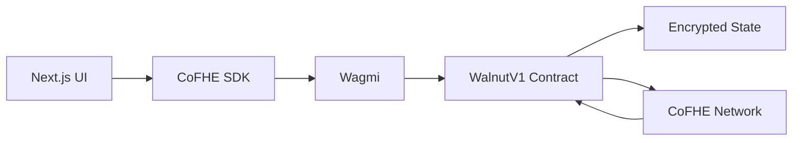
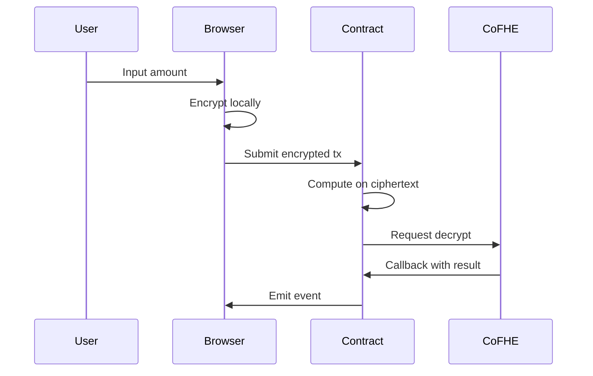

# Walnut Protocol

Privacy-first lending protocol powered by Fully Homomorphic Encryption (FHE). Keep your financial data encrypted on-chain while enabling full lending functionality.

**Live on Arbitrum Sepolia**
- Contract: `0x04c998DD105E444570ba1eCACB3F5524D5695aA0`
- Network: Arbitrum Sepolia (Chain ID: 421614)
- [View on Arbiscan](https://sepolia.arbiscan.io/address/0x04c998DD105E444570ba1eCACB3F5524D5695aA0)

---

## Features

**Private Lending**
- Deposit, borrow, repay, and withdraw with encrypted amounts
- Collateral and debt remain private on-chain
- LTV verification without exposing balances

**Encrypted Credit Scoring**
- Dynamic LTV (70%-90%) based on encrypted repayment history
- 5 credit tiers computed on encrypted data

**Sealed-Bid Liquidation**
- Liquidators submit encrypted bids
- Bids remain private until settlement

**P2P Lending**
- Post offers with encrypted APR, size, and tenor
- Terms revealed only after matching

**ENS Wallet Aggregation**
- Link multiple wallets via ENS
- Aggregate collateral without exposing wallet relationships

---

## Architecture



**Data Flow**



---

## Tech Stack

- **Contracts**: Solidity 0.8.25, CoFHE, Hardhat
- **Frontend**: Next.js 16.2.1, TypeScript, CoFHE SDK v0.5.1
- **Wallet**: Wagmi, Viem, RainbowKit
- **Network**: Arbitrum Sepolia (421614)

---

## Quick Start

```bash
# Install
npm install

# Configure
cp .env.example .env.local
# Add your NEXT_PUBLIC_WALLETCONNECT_PROJECT_ID

# Run
npm run dev
```

**Environment Variables**
```bash
NEXT_PUBLIC_CHAIN_ID=421614
NEXT_PUBLIC_RPC_URL_PRIMARY=https://sepolia-rollup.arbitrum.io/rpc
NEXT_PUBLIC_CONTRACT_ADDRESS=0x04c998DD105E444570ba1eCACB3F5524D5695aA0
NEXT_PUBLIC_WALLETCONNECT_PROJECT_ID=your_project_id
```

---

## Smart Contract

**Deployed**: `WalnutV1` at `0x04c998DD105E444570ba1eCACB3F5524D5695aA0`  
**Archived**: Previous versions in `_archive/contracts/`

**Key Functions**
```solidity
// Lending
deposit(InEuint128 encryptedAmount)
borrow(InEuint128 encryptedAmount)
repay(InEuint128 encryptedAmount)
withdraw(InEuint128 encryptedAmount)

// Credit Scoring
requestCreditTierUpdate(address user)
onCreditCountDecrypted(uint256 requestId, uint128 result) // onlyCoFHE

// Liquidation
requestLiquidationCheck(address user)
openAuction(address borrower)
submitBid(address borrower, InEuint128 encryptedPenalty)
selectWinningBid(address borrower)

// P2P
postOffer(InEuint128 encAPR, InEuint128 encSize, InEuint128 encTenor)
matchOffer(uint256 offerId)

// Aggregation
registerENSWallet(string ensName, address wallet)
getAggregatedCollateral(address owner)
```

---

## Testing

```bash
npx hardhat test
```

**Status**: 8/8 core tests passing
- Complete lending loop
- Credit tier updates
- Liquidation with async callbacks
- Sealed-bid auctions
- P2P lending
- ENS aggregation
- Pause mechanism
- Access control

---

## Deployment

```bash
# Deploy
npx hardhat run scripts/deploy-v1-arbitrum-sepolia.js --network arbitrumSepolia

# Verify
npx hardhat verify --network arbitrumSepolia <CONTRACT_ADDRESS>
```

---

## Privacy Model

**Private (Encrypted)**
- Collateral and debt amounts
- Repayment history
- Liquidation bids
- P2P loan terms (until matched)
- Wallet relationships
- Health factors

**Public (On-Chain Metadata)**
- Wallet addresses
- Transaction timestamps
- Credit tiers (derived)
- Liquidation flags (derived)

---

## Security

**Async Decrypt Pattern**
1. Contract requests decryption from CoFHE
2. CoFHE decrypts off-chain
3. CoFHE calls contract callback
4. Contract verifies caller (onlyCoFHE modifier)
5. Contract updates state

**Properties**
- Only CoFHE can execute callbacks
- Request IDs prevent replay attacks
- No plaintext storage
- Events never emit sensitive data

---

## Future Enhancements

- Multi-asset collateral support
- Cross-chain encrypted state sync
- Privacy-preserving oracles
- Enhanced P2P matching algorithms
- Governance mechanisms

---

## Resources

- [CoFHE SDK Docs](https://docs.fhenix.zone)
- [Arbitrum Docs](https://docs.arbitrum.io)
- [Arbitrum Sepolia Faucet](https://faucet.quicknode.com/arbitrum/sepolia)
- [Arbitrum Sepolia Explorer](https://sepolia.arbiscan.io)

---

## License

MIT License

---

**Walnut Protocol** - Privacy-first lending, finally.
