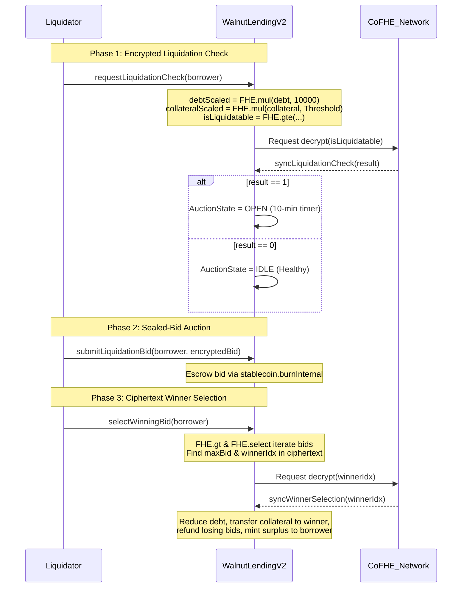

# Encrypted Health Factor & Sealed-Bid Liquidation — Technical Documentation

## Overview

The Liquidation engine in Walnut Protocol protects protocol solvency while shielding borrowers from predatory Maximal Extractable Value (MEV) extraction and public liquidation sniping. On transparent lending platforms (such as Aave, Compound, or MakerDAO), every borrower's health factor is public. Liquidators run automated MEV bots that track positions nearing underwater status, front-running transactions to liquidate borrowers the exact millisecond collateral prices tick down, extracting maximum penalty fees.

Walnut replaces public liquidations with **Encrypted Health Factor Evaluations** and **Sealed-Bid Auctions** powered by Fhenix FHE primitives (`FHE.mul`, `FHE.gte`, `FHE.gt`, `FHE.select`).

---

## How It Works Under the Hood



---

## Technical Implementation Details

### Phase 1: Encrypted Health Factor Evaluation
Anyone can request a liquidation check on a borrower, but the underlying health factor check is computed entirely in ciphertext:

```solidity
function requestLiquidationCheck(address borrower) external whenNotPaused {
    euint128 debt = _getAggregatedDebt(borrower);
    euint128 collateral = _getAggregatedCollateral(borrower);
    
    // Scale values to evaluate: debt * 10000 >= collateral * LIQUIDATION_THRESHOLD (80%)
    euint128 const10000 = FHE.asEuint128(10000);
    euint128 constThreshold = FHE.asEuint128(LIQUIDATION_THRESHOLD);
    euint128 debtScaled = FHE.mul(debt, const10000);
    euint128 collateralScaled = FHE.mul(collateral, constThreshold);
    
    // Perform homomorphic comparison
    ebool isLiquidatable = FHE.gte(debtScaled, collateralScaled);
    euint128 isLiq128 = FHE.asEuint128(isLiquidatable);
    
    uint256 reqId = _requestDecrypt(isLiq128);
    pendingLiquidationChecks[reqId] = borrower;
    emit LiquidationCheckRequested(borrower, reqId);
}
```

- Callback `syncLiquidationCheck`:
  - If `result == 1`, opens a 10-minute sealed-bid auction (`liquidations[borrower].state = AuctionState.OPEN`).
  - If `result == 0`, emits `LiquidationAuctionHealthy(borrower)` and remains IDLE.
  - Plaintext health factor scores are **never** published.

### Phase 2: Sealed-Bid Auction
When an auction opens, liquidators submit encrypted bids in cUSDC:

```solidity
function submitLiquidationBid(address borrower, InEuint128 calldata encryptedAmount) external nonReentrant whenNotPaused {
    Auction storage auc = liquidations[borrower];
    require(auc.state == AuctionState.OPEN, "Auction not open");
    require(block.timestamp <= auc.endTime, "Auction ended");

    euint128 amount = FHE.asEuint128(encryptedAmount);
    
    // Escrow funds by burning cUSDC from bidder
    ebool burnSuccess = stablecoin.burnInternal(msg.sender, amount);
    euint128 validAmount = FHE.select(burnSuccess, amount, FHE.asEuint128(0));
    
    auc.bids.push(LiquidationBid({ bidder: msg.sender, amount: validAmount }));
    emit LiquidationBidSubmitted(msg.sender, borrower);
}
```

Because bids are stored as `euint128` ciphertexts, competing liquidators cannot view submitted bid amounts. This prevents the "penny outbidding" behavior common in transparent auctions.

### Phase 3: Ciphertext Winner Selection & Settlement
After the auction timer expires, `selectWinningBid(borrower)` iterates over submitted bids entirely in ciphertext using homomorphic logic:

```solidity
euint128 maxBid = FHE.asEuint128(0);
euint128 winnerIdx = FHE.asEuint128(0);

for (uint8 i = 0; i < auc.bids.length; i++) {
    euint128 iEnc = FHE.asEuint128(i);
    ebool isNewMax = FHE.gt(auc.bids[i].amount, maxBid);
    maxBid = FHE.select(isNewMax, auc.bids[i].amount, maxBid);
    winnerIdx = FHE.select(isNewMax, iEnc, winnerIdx);
}

// Decrypt ONLY the winning index integer via CoFHE
uint256 reqId = _requestDecrypt(winnerIdx);
pendingWinnerSelections[reqId] = borrower;
```

In `syncWinnerSelection`:
1. **Debt Reduction:** Borrower debt is reduced by the winning bid amount.
2. **Surplus Handling:** If the winning bid exceeds outstanding debt, the surplus cUSDC is minted directly back to the borrower!
3. **Collateral Transfer:** Borrower collateral (including linked secondary wallets) is transferred to the winning bidder's encrypted collateral balance (`_collateral[winner] = FHE.add(...)`).
4. **Losing Bidder Refunds:** All non-winning liquidators receive full refunds of their escrowed bids via `stablecoin.mintInternal`.

---

## Technical Highlights & Under-the-Hood Points

- **Zero MEV Extraction:** Front-running bots cannot target liquidations because health factor levels and bid amounts are encrypted.
- **Fair Market Price Discovery:** Sealed-bid auctions encourage liquidators to submit their true maximum valuation rather than incrementally outbidding rivals by 1 wei.
- **Borrower Protection (Surplus Retention):** Unlike public protocol liquidations that wipe out borrower collateral completely, Walnut's sealed-bid mechanism preserves and returns excess bid proceeds to the distressed borrower.

---

## Smart Contract Contribution

| Function | FHE Primitive / Operation | Technical Role |
|----------|---------------------------|----------------|
| `requestLiquidationCheck()` | `FHE.mul()`, `FHE.gte()` | Computes scaled LTV comparison on ciphertext without leaking health factor score. |
| `submitLiquidationBid()` | `stablecoin.burnInternal()` | Escrows confidential cUSDC liquidation bids. |
| `selectWinningBid()` | `FHE.gt()`, `FHE.select()` | Finds winning bid index in ciphertext across array of encrypted bids. |
| `syncWinnerSelection()` | `FHE.add()`, `FHE.sub()` | Transfers borrower collateral to winner, reduces debt, and refunds losing bidders. |
