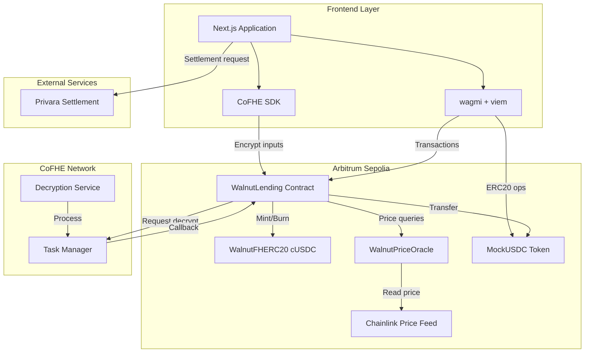
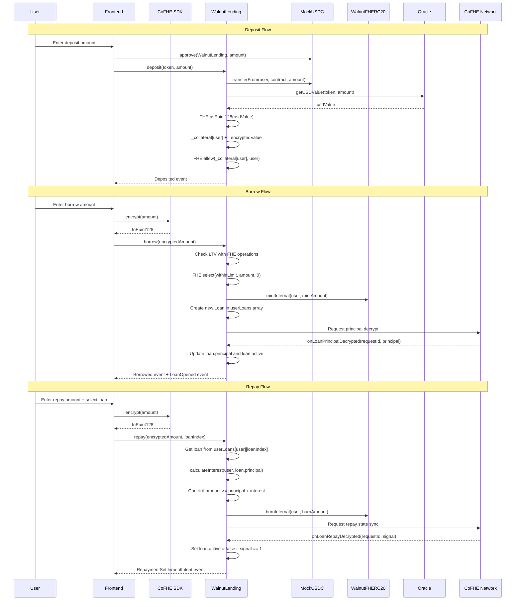
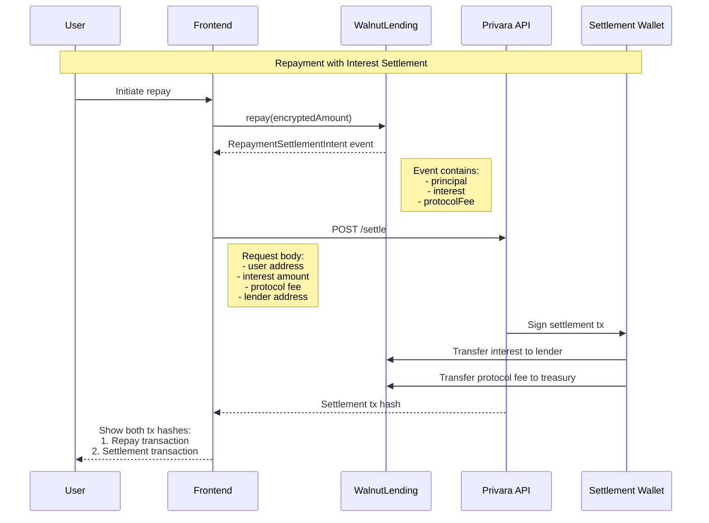
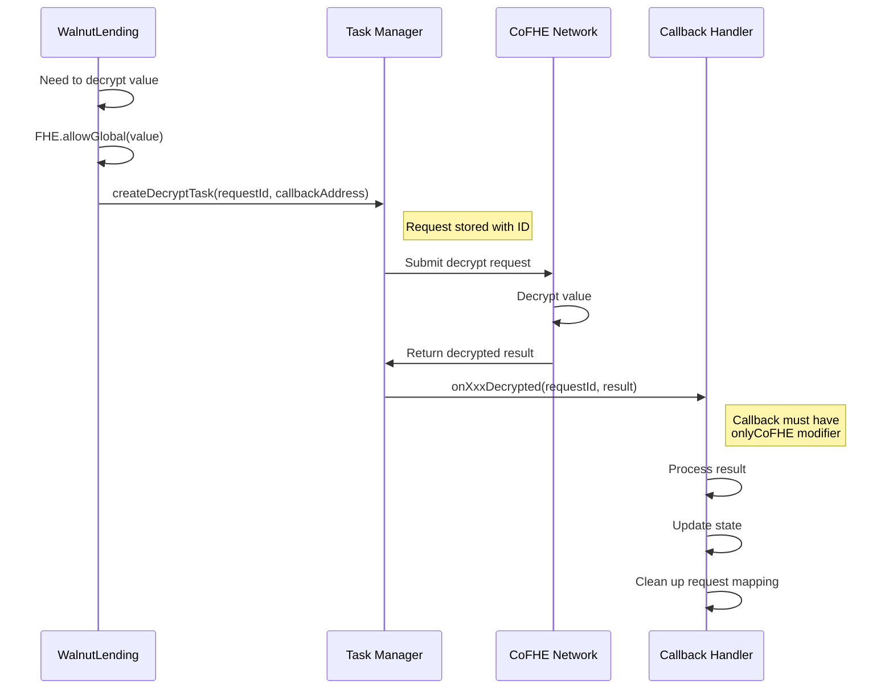

# Walnut Protocol Architecture

This document provides a comprehensive overview of Walnut Protocol's architecture, data flows, and system interactions.

## System Overview

Walnut is a confidential lending protocol that uses Fully Homomorphic Encryption (FHE) to keep user positions private while maintaining protocol functionality. The system consists of smart contracts on Arbitrum Sepolia, a Next.js frontend, and integration with CoFHE for encrypted computation.

## High-Level Architecture



## FHE Data Flow

This diagram shows how encrypted data flows through the system:

```mermaid
flowchart LR
    User[User Input<br/>Plain Amount] --> Browser[Browser<br/>CoFHE SDK]
    Browser -->|Encrypt| Cipher[InEuint128<br/>Ciphertext]
    Cipher -->|Transaction| Contract[WalnutLending<br/>Contract]
    Contract -->|FHE Operations| Compute[Encrypted<br/>Computation]
    Compute -->|Store| Storage[euint128<br/>On-Chain Storage]
    Storage -->|FHE.allow| Permit[User Permit<br/>Authorization]
    Permit -->|Decrypt Request| CoFHE[CoFHE Network]
    CoFHE -->|Decrypted Value| Display[Frontend<br/>Display]
```



### Encryption Flow

1. **Client-Side Encryption**: User enters amount in browser
2. **CoFHE SDK**: Encrypts value using CoFHE public key → `InEuint128`
3. **Transaction**: Encrypted value sent in transaction calldata
4. **Contract Receipt**: Contract receives `InEuint128` and converts to `euint128`
5. **FHE Operations**: Contract performs encrypted arithmetic (add, sub, mul, div, compare)
6. **Storage**: Encrypted result stored as `euint128` handle
7. **Permission Grant**: Contract calls `FHE.allow(value, user)` to grant read access
8. **Permit Creation**: User signs permit to authorize decryption
9. **Decryption**: Frontend requests decryption via CoFHE SDK
10. **Display**: Decrypted value shown to user

## Contract Interaction Diagram



## Privara Settlement Flow

Walnut uses Privara for private interest settlement. This is a two-transaction process:



### Why Two Transactions?

1. **Repay Transaction**: Burns cUSDC and updates encrypted debt
2. **Settlement Transaction**: Transfers interest (encrypted amount) to lender and protocol

The settlement transaction is handled by Privara to keep the interest amount private. The user sees both transaction hashes but the actual interest amount remains encrypted.

## Async Callback Flow

CoFHE uses an async callback pattern for decryption:



### Callback Functions

Walnut implements several callback handlers:

1. **`onLoanPrincipalDecrypted(requestId, result)`**
   - Called after borrow to sync loan principal
   - Updates `userLoans[user][loanIndex].principal` and sets `active = true`
   - Clears pending sync mapping

2. **`onLoanRepayDecrypted(requestId, result)`**
   - Called after repay to confirm full repayment
   - Sets `userLoans[user][loanIndex].active = false` if result == 1
   - Clears loan principal if result == 1
   - Emits `LoanStateCleared` event

3. **`onTotalBorrowedDecrypted(requestId, result)`**
   - Called to sync public aggregate total
   - Updates `totalBorrowed` cache
   - Uses versioning to prevent stale updates

4. **`onGuardCheckDecrypted(requestId, result)`**
   - Called for position guard health checks
   - Emits `PositionGuardTriggered` if result == 1

5. **`onCreditCountDecrypted(requestId, result)`**
   - Called to update credit tier
   - Derives tier from repayment count
   - Updates `creditTier[user]`

## State Management

### Encrypted State

Stored as `euint128` handles (32-byte values):

```solidity
mapping(address => euint128) private _collateral;
mapping(address => euint128) private _debt;
mapping(address => euint128) private _repaymentCount;
mapping(address => euint128) private _defaultCount;
euint128 private _totalBorrowedEncrypted;
```

### Public State

Stored as regular Solidity types:

```solidity
struct Loan {
    uint128 principal;
    uint256 openedAt;
    bool active;
}

mapping(address => Loan[]) private userLoans;
mapping(address => uint8) public creditTier;
uint256 public totalDeposited;
uint256 public totalBorrowed; // Cache of _totalBorrowedEncrypted
```

**Multi-Loan Model**:
- Each user can have multiple concurrent loans
- Each loan tracks its own `principal`, `openedAt` timestamp, and `active` status
- Interest calculated independently per loan
- Repayment targets specific loan by index

### Pending Request Tracking

Used to map callback requestIds to users and loan indices:

```solidity
mapping(uint256 => address) public pendingPrincipalSyncs;
mapping(uint256 => address) public pendingRepaySyncs;
mapping(uint256 => address) public decryptRequests;
mapping(uint256 => address) private _pendingGuardChecks;
mapping(uint256 => uint256) public pendingTotalBorrowedSyncVersions;
```

**Multi-Loan Context:**
- Principal and repay syncs track both user address and loan index
- Multiple loans can have pending syncs simultaneously
- Each sync is independent and doesn't affect other loans

## Permission Model

### FHE Permissions

Walnut uses three permission levels:

1. **`FHE.allowThis(value)`**
   - Grants contract permission to use value in future operations
   - Called after every encrypted operation
   - Required for contract to read its own encrypted state

2. **`FHE.allow(value, user)`**
   - Grants specific address permission to decrypt value
   - Called after writes to grant user read access
   - User must create permit to actually decrypt

3. **`FHE.allowGlobal(value)`**
   - Makes value globally decryptable
   - **Only used for decrypt requests** (not for user data)
   - Required for CoFHE to decrypt and callback

### Access Control

```solidity
modifier onlyOwner()      // Owner-only functions
modifier whenNotPaused()  // Pausable functions
modifier onlyCoFHE()      // CoFHE callback functions
```

**Owner Functions:**
- `pause()` / `unpause()`
- `transferOwnership()`
- `grantAuditorPermit()` / `revokeAuditorPermit()`

**CoFHE-Only Functions:**
- `onLoanPrincipalDecrypted()`
- `onLoanRepayDecrypted()`
- `onTotalBorrowedDecrypted()`
- `onGuardCheckDecrypted()`
- `onCreditCountDecrypted()`

## Interest Calculation

Interest accrues linearly from `borrowTimestamp`:

```solidity
function calculateInterest(address user, uint256 principal)
    public view returns (uint256 totalInterest, uint256 protocolFee, uint256 lenderPayment)
{
    uint256 elapsed = block.timestamp - borrowTimestamp[user];
    totalInterest = (principal * BORROW_APR * elapsed * PRECISION)
        / (SECONDS_PER_YEAR * 10000 * PRECISION);
    protocolFee = totalInterest / 4;  // 25%
    lenderPayment = totalInterest - protocolFee;  // 75%
}
```

**Constants:**
- `BORROW_APR = 800` (8% annual rate, in basis points)
- `PROTOCOL_FEE_APR = 200` (2% annual rate, 25% of total interest)
- `SECONDS_PER_YEAR = 365 days`
- `PRECISION = 1e6` (6 decimals for USD values)

## Credit Tier System

Users progress through tiers based on repayment count:

| Tier | Repayments Required | Max LTV |
|------|---------------------|---------|
| 0    | 0                   | 70%     |
| 1    | 3                   | 75%     |
| 2    | 10                  | 80%     |
| 3    | 25                  | 85%     |
| 4    | 50                  | 90%     |

**Implementation:**
- `_repaymentCount[user]` is encrypted
- `creditTier[user]` is public (derived from count)
- Tier update requires decrypt request + callback
- LTV enforced in `borrow()` using encrypted comparison

## Utilization and Dynamic Rates

```solidity
function utilizationRate() external view returns (uint256) {
    if (totalDeposited == 0) return 0;
    return (totalBorrowed * 10000) / totalDeposited;
}

function currentBorrowRate() external view returns (uint256) {
    if (totalDeposited == 0) return 600;  // 6% base rate
    return 600 + ((totalBorrowed * 600) / totalDeposited);
}
```

**Rate Model:**
- Base rate: 6% (600 bps)
- Slope: 6% (600 bps)
- At 0% utilization: 6% APR
- At 100% utilization: 12% APR
- Linear interpolation between

## Frontend Architecture

### Tech Stack

- **Framework**: Next.js 16.2.1 (App Router)
- **Web3**: wagmi 2.19.5 + viem 2.47.6
- **State**: TanStack Query 5.95.2
- **Encryption**: CoFHE SDK 0.5.0
- **Styling**: Tailwind CSS 4.1.9
- **UI Components**: Custom components with Radix UI primitives

### Key Hooks

1. **`use-walnut-protocol.ts`**
   - Main protocol interaction hook
   - Wraps contract calls with error handling
   - Manages transaction states

2. **`use-permit.ts`**
   - Manages FHE permit creation and storage
   - Handles permit lifecycle
   - Provides permit status

3. **`use-token-balances.ts`**
   - Fetches and decrypts token balances
   - Handles encrypted balance decryption
   - Caches results

### Component Structure

```
components/
├── dashboard/          # Dashboard-specific components
│   ├── empty-state.tsx
│   ├── loan-health.tsx
│   ├── activity-feed.tsx
│   └── protocol-status.tsx
├── landing/           # Landing page components
├── ui/                # Reusable UI components
│   ├── skeleton.tsx
│   └── error-boundary.tsx
└── walnut/            # Protocol-specific components
    ├── permit-provider.tsx
    └── permit-explainer-modal.tsx
```

## Security Considerations

### Protocol-Owned Accounting

Users cannot manipulate debt accounting:
- `userLoans` array is private and contract-controlled
- `repay(loanIndex)` reads loan data internally, not from calldata
- Interest calculated using `loan.openedAt` timestamp
- Each loan maintains independent accounting

### Multi-Loan Support

Supports multiple concurrent loans per user:
- `borrow()` creates new loan, no restriction on existing loans
- Each loan has independent `principal`, `openedAt`, and `active` status
- `repay(loanIndex)` targets specific loan
- View functions: `getLoans()`, `getActiveLoans()`, `hasActiveLoan()`, `getTotalActivePrincipal()`

### Encrypted Aggregates

Public metrics without revealing individual positions:
- `_totalBorrowedEncrypted` is canonical
- `totalBorrowed` is public cache (updated via callback)
- Individual positions remain encrypted

### Callback Security

Only CoFHE can call callbacks:
- `onlyCoFHE` modifier checks `msg.sender == TASK_MANAGER_ADDRESS`
- Prevents attackers from calling callbacks with fake data
- Request mappings cleaned after processing

## Deployment Architecture

### Arbitrum Sepolia Testnet

- **Chain ID**: 421614
- **RPC**: https://sepolia-rollup.arbitrum.io/rpc
- **Explorer**: https://sepolia.arbiscan.io

### Contract Deployment Order

1. MockUSDC (ERC20 token)
2. MockUSDCPriceFeed (Chainlink-compatible)
3. WalnutPriceOracle
4. WalnutFHERC20 (cUSDC)
5. WalnutLending
6. Configuration:
   - `WalnutFHERC20.setMinter(WalnutLending)`
   - `WalnutPriceOracle.setPriceFeed(MockUSDC, MockUSDCPriceFeed)`

### Frontend Deployment

- **Platform**: Vercel
- **Build**: `npm run build`
- **Environment**: `.env.local` for local, Vercel dashboard for production
- **CDN**: Vercel Edge Network

## Performance Considerations

### Gas Optimization

- Encrypted operations are expensive (FHE overhead)
- Batch operations where possible
- Use public cache (`totalBorrowed`) for views
- Minimize decrypt requests

### Frontend Optimization

- Lazy load components
- Cache decrypted values
- Debounce user inputs
- Use React Query for data fetching

### Callback Latency

- Decrypt requests are async (1-5 seconds typical)
- Show loading states during callbacks
- Don't block user on non-critical decrypts
- Use optimistic UI updates where safe

## Future Enhancements

### Planned Features

1. **Sealed-Bid Liquidations**
   - Liquidators submit encrypted bids
   - Contract compares bids without revealing amounts
   - Winner selected via FHE comparison

2. **Credit Score Progression**
   - Automated tier updates
   - On-chain credit history
   - Reputation system

3. **Multi-Collateral Support**
   - Support for multiple ERC20 tokens
   - Weighted collateral baskets
   - Dynamic collateral factors

4. **Governance**
   - Multi-sig ownership
   - Timelock for parameter changes
   - Community voting on protocol upgrades

### Scalability Improvements

- Batch decrypt requests
- Optimize FHE operations
- Layer 2 scaling solutions
- Cross-chain bridges

---

For more information, see:
- [FHE Explainer](fhe-explainer.md)
- [Security Documentation](security.md)
- [User Guide](user-guide.md) *(coming soon)*
- [Contract Documentation](contracts.md) *(coming soon)*
