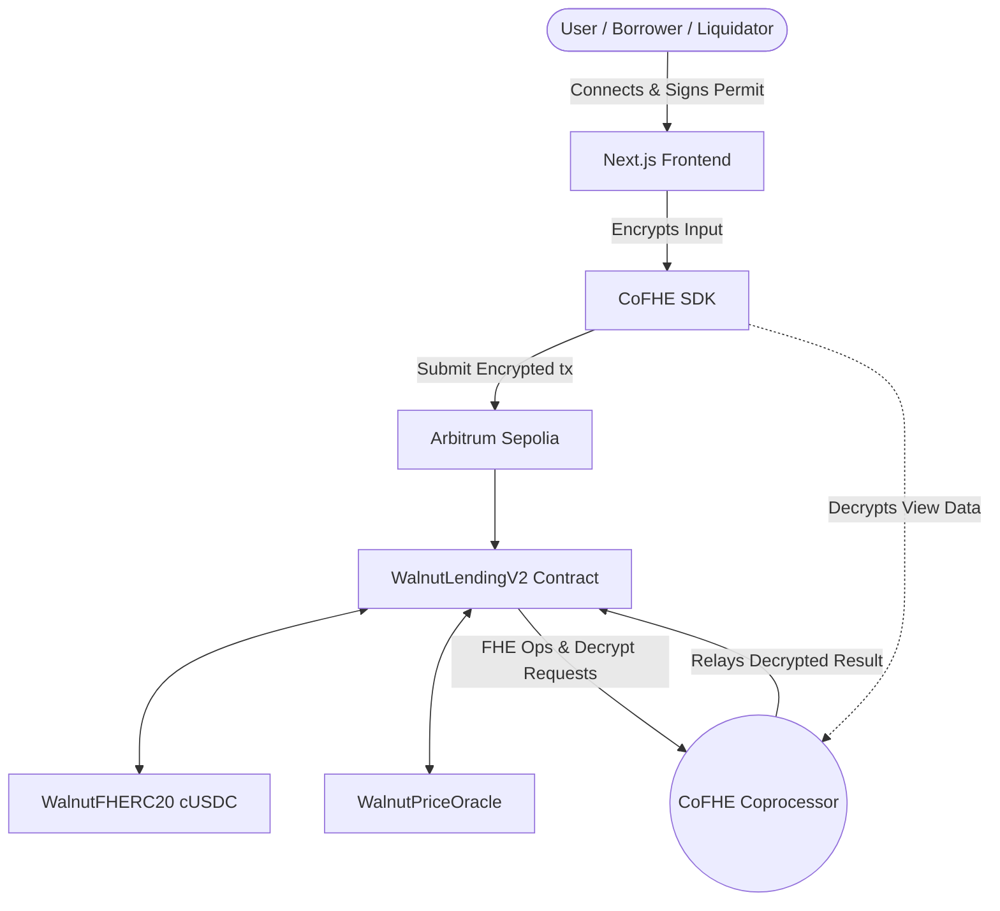
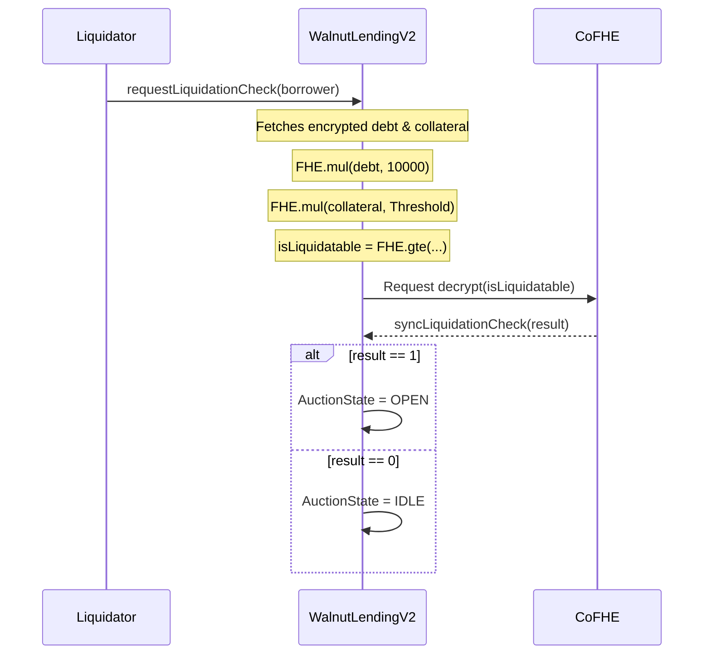
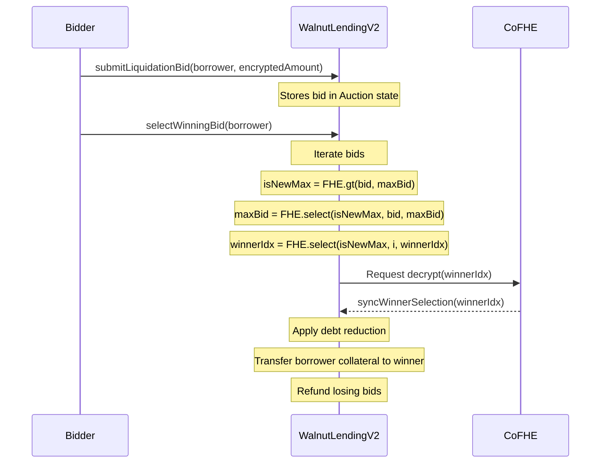

# Walnut Protocol — Technical Documentation

> **Note on Discrepancies (Repo vs. Legacy Draft):** The legacy `walnut.html` draft mentions several features that are not present in the current `WalnutLendingV2.sol` implementation. Specifically, "Multi-wallet ENS collateral", "P2P encrypted lending", and "Selective institutional disclosure" are NOT implemented in the current on-chain contracts. The codebase is the source of truth, and this document reflects the actual protocol state where FHE is used for health factor checks, sealed-bid liquidations, and credit tier derivation from encrypted repayment history.

## 1. Executive Summary

Walnut Protocol is a confidential lending and borrowing protocol deployed on Arbitrum Sepolia (Chain ID: `421614`). By utilizing Fully Homomorphic Encryption (FHE) via the Fhenix CoFHE coprocessor, Walnut ensures that all sensitive user variables—collateral, debt, health factor, and repayment history—are stored and computed as encrypted state (`euint128`). The protocol maintains secure lending operations without exposing individual user positions to the public blockchain, effectively mitigating MEV extraction and opening DeFi to privacy-conscious institutional capital.

## 2. Problem Statement

Every major lending protocol on Ethereum (Aave, Compound, Morpho) is inherently transparent. Every position, wallet, and pending liquidation is readable by anyone. While this transparency fosters trust, it also creates a structural barrier for institutional capital constrained by compliance and risk-book privacy, and enables significant MEV extraction (e.g., front-running liquidations). Traditional privacy solutions like ZK proofs or TEEs fall short at the primitive layer because the core lending logic (like calculating health factors or comparing liquidation bids) still requires operating on plaintext data at some point in the lifecycle.

## 3. Why FHE (The Differentiator)

Walnut leverages FHE to perform computation directly on ciphertexts. This is not cosmetic privacy; it passes the "cannot exist on transparent rails" test:
- **Encrypted Health Factor:** The protocol calculates the collateral-to-debt ratio entirely in FHE. If this were transparent, front-runners could precisely calculate and trigger your liquidation point before you can react.
- **Sealed-Bid Liquidation:** Liquidators submit encrypted bids, and the CoFHE coprocessor selects the minimum penalty bid without exposing the bid amounts. On transparent rails, liquidators simply outbid each other by 1 wei, maximizing the penalty for the borrower. The mechanism only functions properly because the bids remain hidden.
- **Encrypted Credit Scoring:** Credit scores are derived from encrypted repayment histories. If repayment counts were public, the privacy of the borrower's activity would be destroyed.

## 4. High-Level Design

## 5. Low-Level Design

### (a) Encrypted Health Factor Check (Liquidation Check)

### (b) Sealed-Bid Liquidation Auction Flow

## 6. FHE Hooks / Primitives Chart

| FHE Operation | Where It's Used | Why It's Needed There |
|---------------|-----------------|-----------------------|
| `FHE.add()` / `FHE.sub()` | `deposit`, `borrow`, `repay`, `withdraw` | To safely update encrypted collateral, debt, and repayment counters without exposing the amounts. |
| `FHE.mul()` | `requestLiquidationCheck` | To scale encrypted collateral and debt values for precise health factor (LTV) comparisons. |
| `FHE.gte()` | `requestLiquidationCheck` | To determine if a borrower's scaled debt exceeds their scaled collateral threshold, emitting a boolean flag. |
| `FHE.gt()` | `selectWinningBid` | To compare encrypted liquidation bids and find the maximum bid without revealing any bid amounts. |
| `FHE.select()` | `selectWinningBid`, `repay`, `submitLiquidationBid` | To perform conditional logic (e.g., updating the max bid, or conditionally reducing debt based on burn success) purely on-chain while avoiding branching that would expose plaintext data. |
| `FHE.allow()` / `FHE.allowThis()` | All state-mutating functions | To grant the contract and the specific user permission to interact with and decrypt their own ciphertexts via CoFHE permits. |

## 7. Contracts Overview

- **WalnutLendingV2**: The core, privacy-hardened protocol contract. It manages all encrypted deposits, loans, repayments, and liquidations. Per-user state (collateral, debt, repayment counts) is stored as `euint128`, and the contract orchestrates the async callback flow with the CoFHE coprocessor to finalize state changes.
- **WalnutFHERC20 (cUSDC)**: An FHE-enabled ERC20-like stablecoin that allows for encrypted balances and transfers. The lending protocol mints and burns cUSDC based on encrypted borrow and repay actions.
- **WalnutPriceOracle**: A wrapper around Chainlink price feeds that provides USD valuation for collateral assets, which the lending contract then converts into encrypted values for internal accounting.
- **MockUSDC & MockUSDCPriceFeed**: Testnet mock contracts representing the underlying plaintext collateral token and its corresponding Chainlink price feed, used to facilitate deposits and accurate USD scaling in the test environment.

## 8. Feature Deep Dives

### Encrypted Health Factor Engine
Walnut evaluates a user's health factor (collateral vs. debt) entirely within the FHE environment using `FHE.mul()` and `FHE.gte()`. The protocol compares the scaled encrypted debt against the scaled encrypted collateral. The actual health factor remains completely hidden from the public until a liquidation check explicitly reveals a boolean true/false state. This eliminates the possibility of MEV bots front-running transactions based on precise liquidation thresholds, protecting borrowers from predatory extraction.

### Sealed-Bid Liquidation
When a position becomes liquidatable, Walnut initiates a sealed-bid auction. Liquidators submit encrypted bids, and the contract escrows their funds. Once the auction concludes, the protocol iterates through the bids using `FHE.gt()` and `FHE.select()` to determine the highest bid entirely in ciphertext. Only the index of the winning bid is decrypted via CoFHE. This ensures that bidders cannot simply outbid competitors by trivial amounts, securing the best possible outcome (minimum penalty) for the distressed borrower.

### Encrypted Credit Scoring
Walnut incentivizes good borrowing behavior by tracking repayment history using encrypted counters (`_repaymentCount`). As users repay loans, `FHE.add()` increments their counter. This encrypted count is asynchronously decrypted upon request to determine the user's credit tier (0 to 4), unlocking better LTV ratios (up to 85%). The exact repayment history is never exposed, allowing users to build a verifiable on-chain reputation without sacrificing their financial privacy.

## 9. Infrastructure & Stack

- **Chain**: Arbitrum Sepolia (Chain ID: `421614`)
- **FHE Engine**: Fhenix CoFHE Coprocessor (`@fhenixprotocol/cofhe-contracts ^0.5`, `@cofhe/sdk ^0.5.0`)
- **Smart Contracts**: Solidity `0.8.25`, Hardhat `^2.24`, OpenZeppelin `^5`
- **Frontend**: Next.js `16.2.1` (App Router), React `18.3.1`, wagmi `^2.19.5`, viem `^2.47`
- **Settlement**: Reineira / Privara SDK (`@reineira-os/sdk ^0.3.1`). **Status: Partial/Incomplete**. The frontend implements a `use-privara` hook and API route for interest settlement, but the integration represents an async `settlement_processing` state that is prone to failures and requires retries.
- **Test Results**: The repository contains an extensive Hardhat test suite with **55+ passing tests** covering multi-loan support, credit tier LTV enforcement, interest calculations, and the complete user journey.

**Deployed Addresses (From `.env.local` Environment):**
- **WalnutLendingV2**: `0x4A94562d83a183461A42F56E0316083b3C33cb25`
- **WalnutFHERC20**: `0x471D0Cc3127295de11A8021C3C4AcC63bA4967d6`
- **WalnutPriceOracle**: `0x1E77d42C88BE6d7d036149C6e25c04F3d1a7db40`
- **MockUSDC**: `0xbaF9465042BeFA0714E56bcDAddcaF6311FF5F59`
- **MockUSDCPriceFeed**: `0xc55f567ac8E27E0Cb33fcbF62F923BA4b1f827E1`

## 10. Roadmap

The protocol aims to evolve into a durable infrastructure layer for confidential DeFi:
- **Phase 1 — Mainnet Launch:** Audit, deployment on Arbitrum One with production USDC/Chainlink feeds, and implementation of multisig administration.
- **Phase 2 — Token Expansion:** Support for WBTC, WETH, DAI, and USDT with isolated lending markets and tiered collateral factors.
- **Phase 3 — Multichain:** Expansion to Base, Optimism, and Polygon as CoFHE availability grows, enabling cross-chain portable encrypted balances.
- **Phase 4 — Lender Yield & Economics:** Activating lender deposit pools (base APY), liquidity mining, referral systems, and sealed Privara yield distribution.
- **Phase 5 — Institutional Rails:** Permissioned pools (KYC), auditor decryption permits for compliance without individual exposure, and under-collateralized lines of credit for verified entities.

## 11. Design Principles

- **Phase-Gated Execution:** State updates relying on encrypted operations use strict async CoFHE callbacks. Functions are locked against reentrancy, and pending state (e.g., `principalPending`) prevents race conditions.
- **Zero Mock Data:** The protocol relies on actual encrypted state, true cryptographic permits, and robust error handling. Features avoid `setTimeout` fake flows, waiting instead for real on-chain transaction receipts and CoFHE relayer confirmations.
- **Privacy by Default:** From the FHE-enabled `WalnutLendingV2` contract to the frontend EIP-712 permit system, architecture enforces that no plaintext per-user financial amounts are emitted in events or exposed in public getters.
